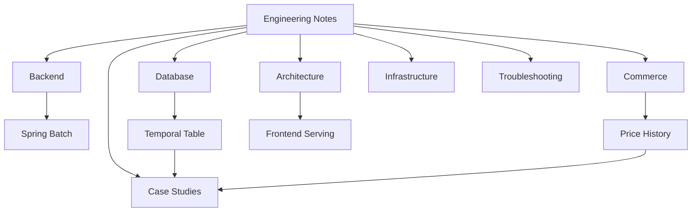

# Engineering Notes

백엔드 개발과 커머스 시스템을 중심으로 실무에서 배운 내용을 정리하는 개인 기술 위키입니다.

Java, Spring, PostgreSQL, AWS, Batch, Commerce Architecture를 주요 주제로 다룹니다. 특정 회사나 서비스의 구현을 설명하기보다, 반복해서 적용할 수 있는 문제 해결 방식과 설계 판단을 기록합니다.

## 주요 카테고리

| 카테고리 | 다루는 내용 |
|---|---|
| [Backend](backend/README.md) | Java, Spring, Batch, Security, API |
| [Database](database/README.md) | Temporal Table, 트랜잭션, 인덱스, 모델링, PostgreSQL |
| [Commerce](commerce/README.md) | 회원, 상품, 가격, 주문, 결제, 재고, 외부 피드 |
| [Architecture](architecture/README.md) | 시스템 설계, 인증, 캐시, 이벤트, 프런트엔드 제공 방식 |
| [Infrastructure](infrastructure/README.md) | AWS, ECS, S3·CloudFront, Redis, 관측성 |
| [Case Studies](case-studies/README.md) | 문제·대안·결정·결과를 중심으로 정리한 설계 사례 |
| [Troubleshooting](troubleshooting/README.md) | 증상부터 재발 방지까지 연결한 장애 해결 기록 |

## 추천 문서

- [Temporal Table과 반개방 구간](database/temporal-table/README.md)
- [상품 가격 이력 설계](commerce/price/product-price-history.md)
- [JPA 없이 구성하는 Spring Batch](backend/batch/spring-batch-without-jpa.md)
- [React·Vite 정적 파일을 S3와 CloudFront로 제공하기](architecture/frontend-serving/react-vite-s3-cloudfront.md)

## 문서 작성 원칙

- 회사 내부 정보와 실제 인프라 식별자를 포함하지 않습니다.
- 실제 경험은 재현 가능한 일반 문제로 바꾸어 작성합니다.
- 단순 개념 설명보다 문제, 대안, 선택 이유, trade-off를 강조합니다.
- 예시는 임의 데이터와 최소 재현 코드로 새로 만듭니다.
- 완결된 블로그 모음보다 지속적으로 수정되는 위키로 운영합니다.

자세한 기준은 [Writing Policy](getting-started/writing-policy.md)에서 확인할 수 있습니다.

## 사이트 구조

## 시작하기

처음 방문했다면 [이 사이트에 대하여](getting-started/about-this-site.md)를 읽은 뒤 추천 문서부터 살펴보세요. 문서의 정확성이나 설명 방식에 대한 제안은 [CONTRIBUTING.md](CONTRIBUTING.md)를 따릅니다.
