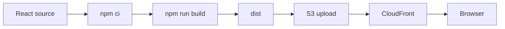
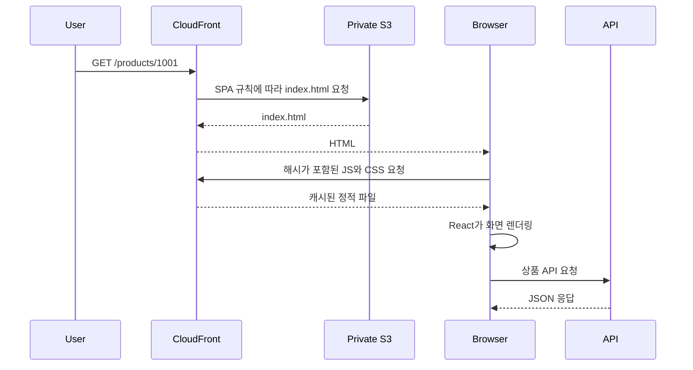
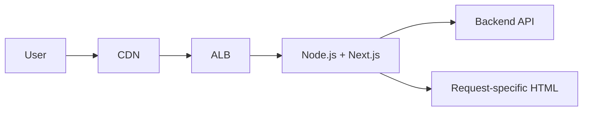

# React·Vite 정적 파일을 S3와 CloudFront로 제공하기

## 핵심 요약

- React는 UI를 구성하는 라이브러리이고, Vite는 개발 서버와 빌드 도구입니다.
- `npm run build`가 만든 기본 `dist` 디렉터리는 HTML, JavaScript, CSS, 이미지 같은 정적 파일입니다.
- CSR SPA라면 운영 요청마다 React를 실행하는 Node.js 서버가 필요하지 않습니다.
- S3는 빌드 파일을 보관하고, CloudFront는 HTTPS, 캐시, 엣지 전송, 오리진 접근 제어를 담당합니다.
- 브라우저 라우팅 fallback, 캐시 수명, 배포 원자성, API 주소와 CORS를 별도로 설계해야 합니다.
- Next.js는 프레임워크이고 Vite는 빌드 도구이므로 단순한 대체 관계가 아닙니다. 비교할 때는 실제 렌더링과 실행 환경을 기준으로 봅니다.

## React와 Vite의 역할

| 도구 | 역할 | 운영 시 반드시 실행되는가? |
|---|---|---|
| React | 컴포넌트와 상태를 이용해 UI 구성 | 브라우저의 JavaScript로 실행 |
| Vite 개발 서버 | 빠른 로컬 개발과 모듈 갱신 | 아니요 |
| Vite 빌드 | 소스 코드를 운영용 정적 파일로 변환 | 배포 전에 실행 |
| npm | 의존성 설치와 스크립트 실행 | 빌드 환경에서 사용 |

React를 사용한다고 자동으로 CSR이 되는 것은 아닙니다. React는 SSR에도 사용할 수 있습니다. 이 문서의 대상은 React SPA를 Vite로 빌드하고 브라우저에서 렌더링하는 구조입니다.

## 개발부터 배포까지



### package.json

```json
{
  "scripts": {
    "dev": "vite",
    "build": "vite build",
    "preview": "vite preview"
  }
}
```

### 빌드

```bash
npm ci
npm run build
```

Vite의 기본 출력 위치는 `dist`입니다. `build.outDir` 설정으로 바꿀 수 있습니다.

```text
dist/
├── index.html
└── assets/
    ├── index-a1b2c3.js
    └── index-d4e5f6.css
```

`vite preview`는 빌드 결과를 로컬에서 확인하기 위한 서버입니다. 운영 서버로 사용하는 명령이 아닙니다.

## CSR SPA 요청 흐름



서버가 `/products/1001`의 완성된 HTML을 만드는 구조가 아닙니다. 브라우저가 `index.html`과 JavaScript를 받은 뒤 라우터가 URL을 해석하고 API 데이터를 불러옵니다.

## S3의 역할

S3에는 다음 정적 결과만 둡니다.

- `index.html`
- 번들 JavaScript와 CSS
- 이미지와 폰트
- 정적 설정 파일

소스 코드 저장소나 Node.js 프로세스를 S3에서 실행하는 것이 아닙니다.

### 공개 웹사이트 엔드포인트와 비공개 오리진

| 방식 | 특징 | 주의점 |
|---|---|---|
| S3 웹사이트 엔드포인트 | S3의 웹사이트 기능과 자체 오류 문서 사용 | CloudFront의 OAC를 사용할 수 없고 오리진 HTTPS 제약이 있음 |
| 비공개 S3 오리진 + OAC | CloudFront만 객체 접근 허용 | SPA fallback을 CloudFront 계층에서 설계 |

공개 서비스의 기본 선택으로는 비공개 S3 오리진과 Origin Access Control을 우선 검토합니다. 사용자는 S3에 직접 접근하지 않고 CloudFront를 통해서만 파일을 받습니다.

## CloudFront의 역할

- 엣지 캐시로 정적 파일 전송 지연을 줄임
- 사용자에게 HTTPS 제공
- 사용자 도메인과 인증서 연결
- S3 오리진 접근 제한
- 압축과 응답 헤더 정책 적용
- 경로별 캐시 정책 분리

CloudFront가 React를 서버에서 렌더링하는 것은 아닙니다. 정적 파일을 캐시하고 전달합니다.

## 운영 Node.js 서버가 필요 없는 이유

Vite가 만든 `dist`는 이미 브라우저가 해석할 수 있는 정적 파일입니다.

```text
요청
  → CloudFront
  → S3의 파일
  → 브라우저에서 React 실행
```

운영 서버에서 템플릿을 만들거나 요청마다 React 코드를 실행하지 않으므로 프런트엔드 전용 Node.js 프로세스가 필요하지 않습니다.

다음 기능이 필요하면 서버 실행 환경이 다시 필요할 수 있습니다.

- 요청마다 달라지는 SSR HTML
- 서버 전용 세션 처리
- 런타임 비밀 자격 정보가 필요한 외부 API 호출
- 이미지 변환이나 서버 액션
- 사용자별 엣지 또는 서버 렌더링

이 경우에도 반드시 단일 Node.js 서버여야 하는 것은 아닙니다. 프레임워크가 지원하는 서버리스나 엣지 실행 환경을 선택할 수 있습니다.

## ALB → Node → Next.js 구조와 비교

동적 Next.js 배포의 한 예는 다음과 같습니다.



정적 Vite SPA와 비교하면 실행 책임이 다릅니다.

| 항목 | React SPA + Vite + S3 | 동적 Next.js + Node |
|---|---|---|
| HTML 생성 | 빌드 시 기본 HTML 생성 | 요청 시 또는 캐시 갱신 시 생성 가능 |
| UI 실행 중심 | 브라우저 | 서버와 브라우저 |
| 프런트 서버 | 불필요 | 동적 기능에는 필요 |
| ALB | 정적 파일 경로에는 불필요 | Node 서비스 앞에 둘 수 있음 |
| 확장 대상 | S3와 CDN | Node 인스턴스, 연결, CPU, 메모리 |
| 장애 지점 | 배포·오리진·캐시 설정 | 정적 경로 외에 서버 런타임 추가 |
| SEO·첫 HTML | 기본 SPA는 제한적 | SSR·SSG 전략 선택 가능 |

Next.js도 정적 산출물만 내보내는 모드라면 Node.js 운영 서버 없이 배포할 수 있습니다. 반대로 Vite도 SSR 구성을 지원합니다. 제품 이름이 아니라 실제 빌드 결과와 요청 처리 방식을 확인해야 합니다.

## CSR, SSR, SSG 비교

| 방식 | HTML 생성 시점 | 서버 필요성 | 적합한 예 |
|---|---|---|---|
| CSR | 브라우저 실행 시 | 정적 파일 제공만 필요 | 로그인 후 관리자 화면 |
| SSR | 사용자 요청 시 | 요청을 처리할 런타임 필요 | 자주 바뀌는 공개 콘텐츠 |
| SSG | 빌드 시 | 정적 파일 제공만 가능 | 문서, 변경이 적은 공개 페이지 |

실제 애플리케이션은 한 방식만 사용하지 않을 수 있습니다. 공개 상품 페이지는 SSR이나 SSG를 사용하고, 로그인 후 화면은 CSR로 구성하는 혼합 전략도 가능합니다.

## SPA 라우팅 fallback

브라우저에서 `/products/1001`로 직접 접속하면 S3에는 그 이름의 객체가 없습니다. React Router가 실행되기 전에 오리진이 403 또는 404를 반환할 수 있습니다.

### 단순한 방법

CloudFront custom error response로 403과 404를 `/index.html`에 연결합니다.

장점은 설정이 쉽다는 것입니다. 단점은 실제로 누락된 JavaScript 파일 요청까지 HTML과 200 응답으로 바뀔 수 있다는 점입니다.

### 더 정교한 방법

CloudFront Function에서 확장자가 없는 화면 경로만 `/index.html`로 다시 씁니다.

```javascript
function handler(event) {
    var request = event.request;
    var uri = request.uri;

    if (uri.endsWith('/')) {
        request.uri += 'index.html';
    } else if (!uri.split('/').pop().includes('.')) {
        request.uri = '/index.html';
    }

    return request;
}
```

이 규칙은 예제입니다. 점이 들어간 라우트, 파일 다운로드 경로, 다국어 경로가 있다면 애플리케이션 URL 규칙에 맞게 테스트해야 합니다.

## 캐시 정책

Vite는 일반적으로 내용 해시가 포함된 자산 파일을 만듭니다.

```text
assets/index-a1b2c3.js
```

내용이 바뀌면 파일명도 바뀌므로 긴 캐시 수명을 줄 수 있습니다. 반면 `index.html`은 최신 자산 파일명을 가리키므로 짧게 캐시하거나 매번 재검증해야 합니다.

| 파일 | 권장 방향 |
|---|---|
| `index.html` | 짧은 캐시, 재검증 |
| 해시 포함 JS·CSS | 긴 캐시, immutable |
| 이름이 고정된 설정 파일 | 변경 방식에 맞는 짧은 캐시 |

배포할 때 새 자산을 먼저 업로드하고 `index.html`을 마지막에 교체하면 새 HTML이 아직 없는 자산을 가리키는 시간을 줄일 수 있습니다. 이전 해시 자산을 즉시 삭제하면 캐시된 이전 HTML이 깨질 수 있으므로 보존 기간을 둡니다.

## 배포 예시

실제 저장소 이름은 배포 환경에서 안전하게 주입합니다.

```bash
aws s3 sync dist/assets s3://<static-bucket>/assets \
  --cache-control "public,max-age=31536000,immutable"

aws s3 cp dist/index.html s3://<static-bucket>/index.html \
  --cache-control "no-cache"
```

이후 필요하면 `index.html` 경로만 CloudFront 무효화합니다. 모든 경로 무효화는 단순하지만 비용과 전파 범위가 커질 수 있습니다.

배포 자동화에는 다음 검증을 포함합니다.

1. `npm ci`
2. 테스트와 정적 검사
3. `npm run build`
4. `dist/index.html`과 자산 존재 확인
5. 자산 업로드
6. `index.html` 업로드
7. 배포 URL의 화면 경로와 자산 응답 확인

## 환경 설정

Vite의 클라이언트 환경 변수는 빌드 결과에 포함되어 브라우저가 읽을 수 있습니다. API 기본 주소처럼 공개 가능한 값만 넣습니다.

민감한 자격 정보가 필요한 호출은 브라우저 번들에 값을 넣지 않고 백엔드 또는 안전한 중계 계층에서 처리합니다.

환경마다 API 주소가 다르면 다음 두 방식을 비교합니다.

| 방식 | 장점 | 단점 |
|---|---|---|
| 환경별 빌드 | 단순하고 타입 연결이 쉬움 | 같은 산출물을 환경 간 승격하기 어려움 |
| 런타임 설정 파일 | 한 산출물을 여러 환경에 사용 | 설정 파일 캐시와 로딩 실패 처리 필요 |

## API 경로와 CORS

정적 화면과 API는 독립 배포할 수 있습니다.

```text
app.example.com  → CloudFront → S3
api.example.com  → ALB → Application
```

브라우저가 서로 다른 origin으로 API를 호출하면 CORS 정책이 필요합니다. 쿠키를 사용한다면 허용 origin, credential, SameSite, 도메인 범위를 함께 검토합니다.

CloudFront behavior로 `/api/*`를 API 오리진에 전달해 같은 도메인처럼 구성할 수도 있습니다. 이 경우 캐시 비활성화, 헤더 전달, 오류 처리, 타임아웃을 정적 자산과 분리합니다.

## 운영 시 주의점

- 루트 화면뿐 아니라 중첩된 SPA 경로 직접 접속을 테스트합니다.
- 누락된 JS 파일이 `index.html`로 바뀌어 200을 반환하지 않는지 확인합니다.
- `index.html`과 해시 자산의 캐시 정책을 분리합니다.
- source map의 공개 범위와 오류 수집 업로드 방식을 결정합니다.
- 정적 파일 배포 실패와 API 배포 실패를 독립적으로 되돌릴 수 있게 합니다.
- CloudFront 로그와 브라우저 오류에서 릴리스 버전을 연결할 수 있게 합니다.
- 비공개 S3 오리진이 CloudFront 외부에서 읽히지 않는지 확인합니다.

## 정리

React SPA를 Vite로 빌드하면 운영 결과는 정적 파일입니다. S3가 파일을 보관하고 CloudFront가 안전하게 캐시·전달하므로 프런트엔드 전용 Node.js 서버를 운영할 필요가 없습니다.

이 구조의 어려운 부분은 빌드 자체보다 SPA fallback, 캐시 수명, 원자적 배포, API 경계입니다. SSR이 필요하면 동적 런타임을 추가하고, SSG로 충분하면 정적 배포의 단순성을 유지합니다.

## 참고자료

- [Vite: Building for Production](https://vite.dev/guide/build.html)
- [Vite: Deploying a Static Site](https://vite.dev/guide/static-deploy.html)
- [AWS: Secure Static Website with CloudFront](https://docs.aws.amazon.com/AmazonCloudFront/latest/DeveloperGuide/getting-started-secure-static-website-cloudformation-template.html)
- [AWS: CloudFront Origins](https://docs.aws.amazon.com/AmazonCloudFront/latest/DeveloperGuide/DownloadDistS3AndCustomOrigins.html)
- [Next.js: Server-side Rendering](https://nextjs.org/docs/pages/building-your-application/rendering/server-side-rendering)
