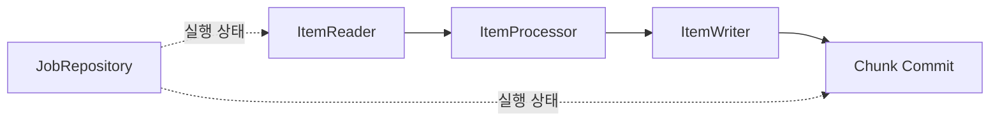

# JPA 없이 구성하는 Spring Batch

## 핵심 요약

- Spring Batch는 JPA 없이 사용할 수 있습니다.
- 업무 데이터는 JDBC 기반 `ItemReader`와 `ItemWriter`로 처리할 수 있습니다.
- `JdbcCursorItemReader`는 하나의 커서를 순차 소비하고, `JdbcPagingItemReader`는 정렬 키를 기준으로 여러 페이지 쿼리를 실행합니다.
- MyBatis는 필수가 아닙니다. 기존 매퍼 재사용이나 복잡한 동적 SQL이 필요할 때 선택합니다.
- Chunk는 처리 묶음이자 일반적인 트랜잭션 커밋 경계입니다.
- 재시작을 위해서는 `JobRepository`, 안정적인 정렬 키, 상태 저장, 멱등한 쓰기가 함께 필요합니다.

이 문서의 예제는 Spring Boot 3와 Spring Batch 5.x 스타일입니다. Spring Batch 6.x는 chunk 처리 API가 확장되었으므로 실제 프로젝트의 의존 버전에 맞는 공식 문서를 확인해야 합니다.

## JPA 없이 가능한 이유

Spring Batch의 핵심 계약은 영속성 기술과 독립적입니다.



| 구성 요소 | 역할 |
|---|---|
| `ItemReader<I>` | 한 번에 한 항목을 읽음 |
| `ItemProcessor<I, O>` | 항목을 검증하거나 변환함 |
| `ItemWriter<O>` | Chunk 단위 항목을 기록함 |
| `JobRepository` | Job·Step 실행 상태와 재시작 정보를 저장함 |
| `PlatformTransactionManager` | Chunk 처리의 트랜잭션 경계를 관리함 |

JPA는 데이터 접근 선택지 중 하나일 뿐입니다. `DataSource`, Spring JDBC, 파일, 메시지 등으로도 같은 배치 모델을 구성할 수 있습니다.

## 필요한 의존성

Spring Boot 프로젝트의 Gradle 예시입니다. 버전은 Boot의 dependency management에 맡깁니다.

```groovy
dependencies {
    implementation 'org.springframework.boot:spring-boot-starter-batch'
    implementation 'org.springframework.boot:spring-boot-starter-jdbc'
    runtimeOnly 'org.postgresql:postgresql'
    testImplementation 'org.springframework.boot:spring-boot-starter-test'
    testImplementation 'org.springframework.batch:spring-batch-test'
}
```

MyBatis와 JPA 의존성은 없습니다.

## Chunk와 Transaction

Chunk 크기가 500이면 일반적인 처리 흐름은 다음과 같습니다.

1. Reader가 최대 500개 항목을 읽습니다.
2. Processor가 각 항목을 변환하거나 제외합니다.
3. Writer가 처리 결과를 기록합니다.
4. 트랜잭션을 커밋합니다.
5. Step 실행 상태와 `ExecutionContext`를 갱신합니다.

Writer에서 예외가 발생하면 해당 Chunk의 데이터베이스 작업이 롤백됩니다. 이미 커밋된 이전 Chunk까지 자동으로 롤백되지는 않습니다.

Chunk 크기는 메모리, 커밋 비용, 잠금 시간, 실패 시 재처리량 사이의 trade-off입니다.

| Chunk 크기 | 장점 | 비용 |
|---|---|---|
| 작음 | 실패 시 재처리량과 잠금 시간이 작음 | 커밋 횟수 증가 |
| 큼 | 커밋 오버헤드 감소 가능 | 메모리·잠금·롤백 범위 증가 |

운영과 비슷한 데이터로 처리량과 데이터베이스 부하를 함께 측정합니다.

## Cursor 방식

`JdbcCursorItemReader`는 쿼리 결과의 커서를 열고 `read()`마다 다음 행을 매핑합니다.

```java
@Bean
JdbcCursorItemReader<SourceOrder> cursorReader(DataSource dataSource) {
    return new JdbcCursorItemReaderBuilder<SourceOrder>()
            .name("sourceOrderCursorReader")
            .dataSource(dataSource)
            .sql("""
                    SELECT id, total_amount
                    FROM source_order
                    WHERE status = 'READY'
                    ORDER BY id
                    """)
            .fetchSize(500)
            .rowMapper((rs, rowNum) -> new SourceOrder(
                    rs.getLong("id"),
                    rs.getBigDecimal("total_amount")
            ))
            .build();
}
```

### 특징

- 하나의 결과 집합을 앞으로 이동하며 읽습니다.
- 페이지마다 쿼리를 다시 실행하지 않습니다.
- 긴 실행 동안 연결과 커서가 유지될 수 있습니다.
- JDBC 드라이버의 fetch 동작과 커서 지원을 확인해야 합니다.
- 기본 설정에서는 Reader 커서 연결과 Step 처리 트랜잭션 연결이 다를 수 있습니다.
- `JdbcCursorItemReader` 자체는 thread-safe하지 않습니다.

긴 커서가 데이터베이스 운영 정책과 충돌하거나 재시작 비용이 크다면 Paging을 검토합니다.

## Paging 방식

`JdbcPagingItemReader`는 페이지 크기만큼 여러 번 쿼리합니다.

```java
@Bean
JdbcPagingItemReader<SourceOrder> pagingReader(DataSource dataSource) {
    return new JdbcPagingItemReaderBuilder<SourceOrder>()
            .name("sourceOrderPagingReader")
            .dataSource(dataSource)
            .selectClause("SELECT id, total_amount")
            .fromClause("FROM source_order")
            .whereClause("WHERE status = :status")
            .sortKeys(Map.of("id", Order.ASCENDING))
            .parameterValues(Map.of("status", "READY"))
            .pageSize(500)
            .rowMapper((rs, rowNum) -> new SourceOrder(
                    rs.getLong("id"),
                    rs.getBigDecimal("total_amount")
            ))
            .build();
}
```

정렬 키는 결과 순서를 안정적으로 결정해야 하며 고유 키 제약이 있는 컬럼을 사용하는 것이 안전합니다. 정렬 키가 중복되면 페이지 경계에서 항목이 누락되거나 중복될 수 있습니다.

### Offset Paging과 Keyset 관점

페이지 리더의 실제 SQL은 데이터베이스별 `PagingQueryProvider`가 만듭니다. 데이터가 매우 크고 뒤 페이지로 갈수록 느려진다면 생성된 SQL과 실행 계획을 먼저 확인합니다.

업무 요구가 단순하다면 마지막 처리 ID를 `ExecutionContext`에 저장하는 커스텀 keyset Reader도 대안입니다.

```sql
SELECT id, total_amount
FROM source_order
WHERE status = 'READY'
  AND id > :last_seen_id
ORDER BY id
LIMIT :page_size;
```

커스텀 Reader는 상태 저장과 재시작 계약을 직접 구현하고 테스트해야 합니다.

## Cursor와 Paging 비교

| 기준 | Cursor | Paging |
|---|---|---|
| 데이터 읽기 | 한 결과 집합을 순차 소비 | 여러 페이지 쿼리 |
| 연결 유지 | 길어질 수 있음 | 페이지마다 반환 가능 |
| 쿼리 횟수 | 보통 1회 | 여러 회 |
| 데이터 변경 영향 | DB 격리 수준과 커서 스냅샷에 의존 | 페이지 사이 데이터 변경에 주의 |
| 재시작 | 커서 위치 복구 비용 확인 | 고유 정렬 키가 중요 |
| 대량 처리 | 드라이버 fetch 설정 중요 | 페이지 SQL과 인덱스 중요 |
| 적합한 상황 | 안정된 순차 읽기, 단순 쿼리 | 긴 연결 회피, 명시적 페이지 처리 |

둘 중 하나를 이름만 보고 선택하지 않습니다. 실행 시간, 원본 데이터 변경 가능성, 연결 제한, 쿼리 계획을 기준으로 측정합니다.

## MyBatis가 필요한 경우

MyBatis는 다음 상황에서 유용할 수 있습니다.

- 기존 MyBatis 매퍼와 SQL을 재사용해야 함
- 조건 조합이 복잡한 동적 SQL이 핵심임
- 결과 매핑 규칙이 이미 매퍼에 축적되어 있음

다음 상황에서는 Spring JDBC만으로 충분한 경우가 많습니다.

- 단순한 순차 또는 페이지 조회
- 명시적인 SQL과 `RowMapper`로 표현 가능
- `JdbcBatchItemWriter`로 일괄 쓰기 가능

추가 프레임워크는 매퍼 관리와 테스트 비용도 늘립니다. 배치라는 이유만으로 MyBatis를 도입할 필요는 없습니다.

## 최소 예제

### 예제 테이블

```sql
CREATE TABLE source_order (
    id            bigint PRIMARY KEY,
    total_amount  numeric(19, 2) NOT NULL,
    status        varchar(20) NOT NULL
);

CREATE TABLE order_export (
    order_id       bigint PRIMARY KEY,
    total_amount   numeric(19, 2) NOT NULL,
    exported_at    timestamptz(6) NOT NULL DEFAULT CURRENT_TIMESTAMP
);

INSERT INTO source_order (id, total_amount, status)
VALUES
    (1, 12000, 'READY'),
    (2, 35000, 'READY'),
    (3,  8000, 'HOLD');
```

### 데이터 타입

```java
public record SourceOrder(long id, BigDecimal totalAmount) {
}

public record ExportOrder(long orderId, BigDecimal totalAmount) {
}
```

### Processor

```java
@Bean
ItemProcessor<SourceOrder, ExportOrder> orderProcessor() {
    return item -> new ExportOrder(item.id(), item.totalAmount());
}
```

Processor에서 외부 시스템 호출이나 별도 커밋을 수행하면 Chunk 롤백과 원자성이 어긋날 수 있습니다. 가능하면 순수 변환과 검증에 집중합니다.

### Writer

```java
@Bean
JdbcBatchItemWriter<ExportOrder> orderWriter(DataSource dataSource) {
    return new JdbcBatchItemWriterBuilder<ExportOrder>()
            .dataSource(dataSource)
            .sql("""
                    INSERT INTO order_export (order_id, total_amount)
                    VALUES (?, ?)
                    ON CONFLICT (order_id)
                    DO UPDATE SET total_amount = EXCLUDED.total_amount
                    """)
            .itemPreparedStatementSetter((item, statement) -> {
                statement.setLong(1, item.orderId());
                statement.setBigDecimal(2, item.totalAmount());
            })
            .build();
}
```

`ON CONFLICT`는 예제 Writer를 멱등하게 만드는 한 방법입니다. 실제 업무에서는 이미 내보낸 주문을 덮어써도 되는지 정책을 먼저 정해야 합니다.

### Step과 Job

```java
@Configuration
class OrderExportJobConfiguration {

    @Bean
    Step exportOrdersStep(
            JobRepository jobRepository,
            PlatformTransactionManager transactionManager,
            JdbcPagingItemReader<SourceOrder> pagingReader,
            ItemProcessor<SourceOrder, ExportOrder> orderProcessor,
            JdbcBatchItemWriter<ExportOrder> orderWriter
    ) {
        return new StepBuilder("exportOrdersStep", jobRepository)
                .<SourceOrder, ExportOrder>chunk(500, transactionManager)
                .reader(pagingReader)
                .processor(orderProcessor)
                .writer(orderWriter)
                .build();
    }

    @Bean
    Job exportOrdersJob(
            JobRepository jobRepository,
            Step exportOrdersStep
    ) {
        return new JobBuilder("exportOrdersJob", jobRepository)
                .start(exportOrdersStep)
                .build();
    }
}
```

Spring Boot가 제공하는 Batch 자동 구성을 사용한다면 `JobRepository`, 실행기, 트랜잭션 관리자를 애플리케이션 설정에 맞게 구성할 수 있습니다. 직접 `@EnableBatchProcessing`을 추가하면 Boot 자동 구성과의 관계가 달라질 수 있으므로 사용 중인 Boot 버전의 동작을 확인합니다.

## Restart와 JobRepository

`JobRepository`는 다음 메타데이터를 관계형 데이터베이스에 저장합니다.

- `JobInstance`
- `JobExecution`
- `StepExecution`
- `ExecutionContext`

실패한 Job을 같은 식별 파라미터로 다시 실행하면 완료된 Step은 기본적으로 건너뛰고 실패 지점의 상태를 바탕으로 재시작할 수 있습니다.

재시작 가능성은 메타데이터 테이블만으로 보장되지 않습니다.

### Reader 이름

상태를 저장하는 Reader는 Job 안에서 고유하고 안정적인 이름이 필요합니다.

```java
.name("sourceOrderPagingReader")
```

이 이름을 배포마다 바꾸면 기존 `ExecutionContext`와 연결되지 않을 수 있습니다.

### Job Parameter

새로운 임의 실행 번호를 매번 식별 파라미터로 넣으면 실패 Job의 재시작이 아니라 새 JobInstance가 됩니다. 업무 일자나 파일 ID처럼 실행을 식별하는 값을 구분하고, 재시도 파라미터 정책을 문서화합니다.

### Writer 멱등성

커밋 이후 메타데이터 갱신 전 실패, 외부 시스템 타임아웃 등에서는 같은 항목이 다시 처리될 가능성을 고려합니다.

- 업무 키의 유일 제약
- upsert
- 처리 완료 표식
- 외부 요청의 멱등 키

중 하나를 업무 의미에 맞게 선택합니다.

### 메타데이터 스키마

로컬 개발에서는 자동 초기화가 편리하지만, 운영에서는 애플리케이션 버전과 메타데이터 스키마 변경을 데이터베이스 마이그레이션으로 관리하는 편이 안전합니다.

## 운영 시 주의점

### 원본 데이터가 처리 중 바뀌는 경우

Paging 도중 상태가 `READY`에서 다른 값으로 바뀌면 페이지 경계가 흔들릴 수 있습니다. 다음 중 하나를 검토합니다.

- 처리 대상을 먼저 작업 테이블에 고정
- 기준 시각 이전 데이터만 선택
- 상태 전이를 원자적으로 선점
- 변경되지 않는 단조 증가 키로 keyset 처리

### 다중 인스턴스 실행

애플리케이션 스케줄러가 여러 인스턴스에서 동시에 Job을 시작할 수 있습니다. JobRepository의 동일 JobInstance 생성 제어만 믿기 전에 파라미터 생성 방식, 스케줄 락, 업무 데이터 선점을 함께 확인합니다.

### 예외 처리

무조건 skip이나 retry를 켜지 않습니다.

| 실패 | 일반적인 판단 |
|---|---|
| 형식이 잘못된 한 행 | 격리 후 skip 후보 |
| 일시적 네트워크 오류 | 제한된 retry 후보 |
| 무결성 위반 | 데이터 또는 로직 수정 후 실패 처리 |
| 인증·권한 오류 | 즉시 실패하고 운영 알림 |

### 관측성

Job 이름, 실행 ID, Step 상태, 읽기·처리·쓰기·건너뜀 건수, 실행 시간, 실패 분류를 남깁니다. 업무 식별자를 로그에 남길 때는 개인정보와 데이터 노출을 피합니다.

## 정리

JPA는 Spring Batch의 필수 조건이 아닙니다. JDBC Reader와 Writer만으로도 대량 데이터를 Chunk 단위 트랜잭션으로 처리하고, JobRepository를 통해 실행 상태를 관리할 수 있습니다.

Cursor와 Paging의 선택보다 더 중요한 것은 안정적인 정렬, 멱등한 쓰기, 재시작 파라미터, 동시 실행 제어입니다. 최소 예제로 동작을 확인한 뒤 운영 데이터 규모와 실패 시나리오로 확장합니다.

## 참고자료

- [Spring Batch 5.2 Database Readers](https://docs.spring.io/spring-batch/reference/5.2/readers-and-writers/database.html)
- [Spring Batch Chunk-oriented Processing](https://docs.spring.io/spring-batch/reference/step/chunk-oriented-processing.html)
- [Spring Batch Restart](https://docs.spring.io/spring-batch/reference/step/chunk-oriented-processing/restart.html)
- [Spring Batch JobRepository](https://docs.spring.io/spring-batch/reference/5.2/job/configuring-repository.html)
- [JdbcCursorItemReader API](https://docs.spring.io/spring-batch/docs/5.2.6/api/org/springframework/batch/item/database/JdbcCursorItemReader.html)
