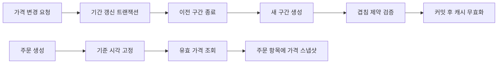

# Temporal Table 설계 사례

## 핵심 요약

가격 이력 조회에서 경계 시각의 중복과 공백을 동시에 없애기 위해 폐구간과 시간 차감 규칙을 반개방 구간 `[start, end)`로 바꾸는 설계 사례입니다.

- 결정: `start_at <= t AND t < end_at`
- 인접 조건: `previous.end_at = next.start_at`
- 보호 장치: 한 업무 키의 변경 직렬화, 겹침 제약, 마이그레이션 검증
- 남는 trade-off: 기존 조회식과 캐시, 예약 데이터, 외부 연동의 동시 전환이 필요함

이 사례의 이름, 데이터, SQL은 설명을 위해 새로 만든 것입니다.

## 문제 상황

한 상품의 가격이 다음처럼 바뀐다고 가정합니다.

| 가격 | 시작 | 다음 가격 시작 |
|---:|---|---|
| 10,000원 | 09:00 | 10:00 |
| 11,000원 | 10:00 | 11:00 |

기존 모델이 시작과 끝을 모두 포함하는 조회식을 사용하면 종료 시각을 결정하기 어렵습니다.

```sql
WHERE start_at <= :as_of
  AND :as_of <= end_at
```

### 선택 1: 다음 시작과 같은 종료 시각

```text
10,000원: [09:00, 10:00]
11,000원: [10:00, 11:00]
```

`10:00`에 두 행이 모두 조회됩니다.

### 선택 2: 종료 시각에서 1초 차감

```text
10,000원: [09:00, 09:59:59]
11,000원: [10:00, 11:00]
```

`09:59:59.500`에는 조회되는 행이 없습니다.

### 선택 3: 종료 시각에서 1마이크로초 차감

현재 저장소만 보면 동작할 수 있지만, 다음 가정이 설계 전체에 퍼집니다.

- 모든 입력과 조회가 마이크로초보다 높은 정밀도를 사용하지 않는다.
- 직렬화 과정에서 반올림이나 절삭이 생기지 않는다.
- 다른 데이터베이스나 분석 시스템도 같은 최소 단위를 사용한다.
- 모든 쓰기 경로가 동일한 차감 함수를 호출한다.

문제의 본질은 정밀도가 아니라 경계 포함 규칙입니다.

## 제약

| 제약 | 설계 영향 |
|---|---|
| 현재 가격 조회가 많음 | 단일 상품·특정 시점 조회가 단순해야 함 |
| 미래 가격 예약이 있음 | 현재 열린 행만 찾는 규칙으로는 부족함 |
| 가격 변경과 주문 생성이 경쟁함 | 가격을 결정하는 기준 시각과 트랜잭션 경계가 필요함 |
| 기존 데이터에 겹침 가능성이 있음 | 제약조건을 즉시 추가할 수 없음 |
| 여러 쓰기 경로가 존재할 수 있음 | 공통 서비스뿐 아니라 DB 제약이 필요함 |

## 조사

설계 변경 전에 다음을 확인합니다.

1. 가격을 읽는 모든 SQL과 ORM 조건
2. 가격을 생성·수정·복사하는 모든 경로
3. 초, 밀리초, 마이크로초 절삭 또는 반올림
4. 종료 없는 구간의 표현
5. 주문에 적용 가격을 스냅샷으로 남기는 시점
6. 예약 가격 시작 시 캐시 무효화 방식
7. 기존 데이터의 겹침, 공백, 역전 구간



## 대안

| 대안 | 장점 | 단점 |
|---|---|---|
| 폐구간 + 1초 차감 | 초 단위 시스템에서는 이해하기 쉬움 | 소수초 조회에서 공백 |
| 폐구간 + 1마이크로초 차감 | PostgreSQL의 기본 해상도 안에서 촘촘함 | 최소 단위에 결합되고 쓰기 경로 누락 위험 |
| 반개방 구간 | 인접 경계가 같고 기간 계산이 단순함 | 기존 조회식과 데이터 전환 필요 |
| 현재 가격과 예약 가격을 별도 테이블로 분리 | 현재 조회가 단순함 | 이력 조회와 전환 로직이 분산됨 |

## 결정

기간은 `[start, end)`로 통일합니다.

```text
10,000원: [09:00, 10:00)
11,000원: [10:00, 11:00)
```

같은 시각에 최대 한 행만 유효하도록 다음 불변식을 둡니다.

1. `start_at < end_at` 또는 `end_at IS NULL`
2. 같은 상품의 기간은 겹치지 않음
3. 연속 가격이 필요하면 이전 종료와 다음 시작이 같음
4. 열린 기간은 업무 키마다 최대 하나
5. 주문은 조회한 가격을 스냅샷으로 저장

## 구현

### 조회식 교체

변경 전:

```sql
WHERE start_at <= :as_of
  AND :as_of <= end_at
```

변경 후:

```sql
WHERE start_at <= :as_of
  AND (end_at IS NULL OR :as_of < end_at)
```

### 새 구간 추가

기준 시각을 한 번 생성하고 이전 종료와 다음 시작에 같은 값을 사용합니다.

```sql
BEGIN;

SELECT pg_advisory_xact_lock(1001);

UPDATE product_price_period
SET end_at = '2026-04-01 00:00:00+00'
WHERE product_id = 1001
  AND end_at IS NULL;

INSERT INTO product_price_period
    (product_id, amount, start_at, end_at)
VALUES
    (1001, 13000, '2026-04-01 00:00:00+00', NULL);

COMMIT;
```

애플리케이션에서 `now()`를 두 번 호출해 미세하게 다른 값을 만들지 않습니다. 요청 단위의 기준 시각을 하나 정해 전달합니다.

## 데이터 전환

기존 폐구간의 종료값이 `다음 시작 - 1마이크로초`라면 무조건 1마이크로초를 더하는 일괄 UPDATE부터 실행하지 않습니다. 먼저 실제 인접 관계를 계산합니다.

```sql
WITH sequenced AS (
    SELECT
        id,
        product_id,
        start_at,
        end_at,
        lead(start_at) OVER (
            PARTITION BY product_id
            ORDER BY start_at
        ) AS next_start_at
    FROM legacy_price_period
)
SELECT id, product_id, start_at, end_at, next_start_at
FROM sequenced
WHERE next_start_at IS NOT NULL
  AND end_at <> next_start_at;
```

결과를 다음 유형으로 분류합니다.

| 유형 | 판정 |
|---|---|
| `end_at = next_start_at - 기존 최소 단위` | 반개방 종료로 변환 후보 |
| `end_at < next_start_at` | 의도한 공백인지 확인 |
| `end_at > next_start_at` | 기존 중복 해결 필요 |
| `start_at >= end_at` | 잘못된 기간 |

## 검증

### 경계 테스트

각 구간마다 최소 세 시각을 확인합니다.

```text
start_at 직전
start_at
end_at 직전
end_at
```

| 기준 시각 | 기대 결과 |
|---|---|
| 첫 시작 직전 | 결과 없음 |
| 첫 시작과 같음 | 첫 구간 |
| 첫 종료 직전 | 첫 구간 |
| 첫 종료와 같음 | 다음 구간 |

### 조회 결과 개수

가격이 반드시 존재해야 하는 상품과 시각 표본에서는 조회 결과가 정확히 한 행이어야 합니다.

```sql
SELECT count(*)
FROM product_price_period
WHERE product_id = :product_id
  AND start_at <= :as_of
  AND (end_at IS NULL OR :as_of < end_at);
```

### 동시성 테스트

같은 상품의 가격을 동시에 변경하고 다음을 확인합니다.

- 둘 중 하나가 명확한 충돌로 실패하는가?
- 성공한 트랜잭션 이후 열린 구간이 하나인가?
- 겹치는 기간이 생성되지 않았는가?
- 실패 요청을 재시도해도 중복 행이 생기지 않는가?

## 단계적 적용

1. 기존 데이터의 겹침·공백·역전 구간을 조사합니다.
2. 읽기 코드를 공통 조회 함수로 모읍니다.
3. 쓰기 경로가 하나의 기준 시각을 사용하게 만듭니다.
4. 전환 데이터를 별도 환경에서 생성하고 경계 테스트를 수행합니다.
5. 애플리케이션 조회식과 데이터를 같은 배포 단위로 전환합니다.
6. 데이터가 정리된 뒤 겹침 제약과 부분 유일 인덱스를 추가합니다.
7. 경계 시각의 조회 실패와 복수 조회를 운영 지표로 감시합니다.

읽기 코드만 먼저 바꾸거나 데이터만 먼저 바꾸면 전환 중 의미가 달라질 수 있습니다. 호환 기간이 필요하면 새 컬럼이나 버전 필드를 두는 이중 읽기 전략을 설계합니다.

## 장점과 단점

### 장점

- 경계 시각의 소유권이 명확합니다.
- 최소 시간 단위 차감 코드가 사라집니다.
- SQL, Java, 외부 인터페이스에 같은 규칙을 적용하기 쉽습니다.
- 범위 타입과 exclusion constraint로 겹침을 방지할 수 있습니다.

### 단점

- 기존 폐구간 데이터와 모든 조회식을 함께 전환해야 합니다.
- 과거 데이터의 의도한 공백과 오류 공백을 자동으로 구분할 수 없습니다.
- 동시 변경을 직렬화하는 별도 정책이 필요합니다.
- 외부 시스템이 폐구간을 사용하면 인터페이스 경계에서 변환이 필요합니다.

## 배운 점

- 시간 정밀도를 높이는 것과 기간 모델을 올바르게 만드는 것은 다른 문제입니다.
- History와 Temporal은 테이블 이름이 아니라 답해야 하는 질문으로 구분해야 합니다.
- `SELECT 후 INSERT` 검사는 동시 요청을 막지 못하므로 DB 무결성이 필요합니다.
- 마이그레이션은 값 변환보다 의미 변환을 검증하는 작업입니다.
- 주문처럼 금전 결과를 재현해야 하는 데이터에는 유효 가격 조회와 별도로 스냅샷이 필요합니다.

## 참고자료

- [Temporal Table과 반개방 구간](../database/temporal-table/README.md)
- [PostgreSQL Range Types](https://www.postgresql.org/docs/current/rangetypes.html)
- [PostgreSQL Constraints](https://www.postgresql.org/docs/current/ddl-constraints.html)
