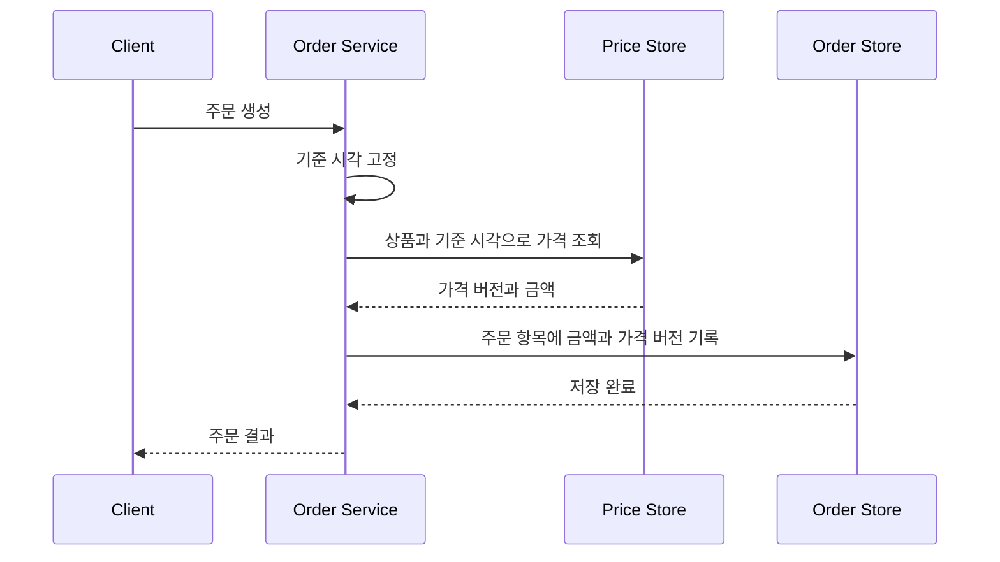

# 상품 가격 이력 설계

## 핵심 요약

- 가격은 변경 기록과 유효 기간을 구분해야 합니다. 변경 시각과 가격이 적용되는 시각은 같지 않을 수 있습니다.
- 현재 가격, 미래 예약 가격, 과거 가격을 한 규칙으로 조회하려면 `[valid_from, valid_to)`를 사용합니다.
- 판매가·공급가·원가를 한 행에 둘지는 변경 주기, 조회 단위, 권한, 정합성 요구로 결정합니다.
- 현재 가격을 `valid_to IS NULL`로만 찾으면 미래 예약 행을 현재 값으로 잘못 선택할 수 있습니다.
- 주문에는 조회한 가격을 스냅샷으로 저장합니다. 가격 이력만 참조하면 사후 정정에 따라 주문 금액 재현이 흔들릴 수 있습니다.

## 문제 상황

상품 가격에는 여러 종류가 있습니다.

| 가격 | 예시 역할 |
|---|---|
| 판매가 | 고객에게 제시하는 기본 가격 |
| 공급가 | 공급 계약이나 정산의 기준 |
| 원가 | 손익과 마진 계산의 내부 기준 |

세 값은 함께 바뀔 수도 있고 독립적으로 바뀔 수도 있습니다. 여기에 미래 예약, 과거 조회, 주문 시점 재현까지 필요하면 단순히 상품 테이블의 가격 컬럼을 덮어쓰는 방식으로는 부족합니다.

## 변경 이력과 유효기간 데이터

| 구분 | 변경 이력 | 유효기간 데이터 |
|---|---|---|
| 질문 | 언제 누가 어떤 요청으로 바꿨는가? | 특정 시각에 얼마가 적용되는가? |
| 시간 | 기록 시각 | 적용 시작·종료 시각 |
| 미래 예약 | 변경 이벤트는 지금 발생 | 가격 적용은 미래에 시작 |
| 수정 | 보통 이벤트를 추가 | 잘못된 기간을 정정할 수 있음 |
| 주문 재현 | 보조 근거 | 가격 선택 근거 |

예를 들어 운영자가 3월 20일에 4월 1일 가격을 예약하면 다음 두 시간이 다릅니다.

```text
recorded_at = 2026-03-20
valid_from = 2026-04-01
```

`updated_at` 하나로 두 의미를 표현하면 예약 가격을 설명하기 어렵습니다.

## 기간 규칙

가격 유효 기간은 `[valid_from, valid_to)`로 표현합니다.

```sql
WHERE valid_from <= :as_of
  AND (valid_to IS NULL OR :as_of < valid_to)
```

연속된 가격은 이전 `valid_to`와 다음 `valid_from`을 같은 값으로 저장합니다.

```text
10,000원: [2026-01-01, 2026-04-01)
11,000원: [2026-04-01, ∞)
```

4월 1일 0시에는 11,000원만 유효합니다.

## 가격 컬럼을 한 테이블에 둘 때

```sql
CREATE TABLE product_price_version (
    id             bigint GENERATED ALWAYS AS IDENTITY PRIMARY KEY,
    product_id     bigint NOT NULL,
    sale_price     numeric(19, 2) NOT NULL,
    supply_price   numeric(19, 2),
    cost_price     numeric(19, 2),
    valid_from     timestamptz(6) NOT NULL,
    valid_to       timestamptz(6),
    recorded_at    timestamptz(6) NOT NULL DEFAULT CURRENT_TIMESTAMP,
    change_reason  varchar(200),
    CHECK (sale_price >= 0),
    CHECK (supply_price IS NULL OR supply_price >= 0),
    CHECK (cost_price IS NULL OR cost_price >= 0),
    CHECK (valid_to IS NULL OR valid_from < valid_to),
    UNIQUE (product_id, valid_from)
);
```

### 장점

- 상품의 가격 묶음을 한 행과 한 조회로 읽습니다.
- 세 가격이 같은 버전으로 확정되었다는 의미가 명확합니다.
- 한 트랜잭션에서 세 값의 정합성을 검증하기 쉽습니다.
- 주문, 관리자 화면, 통계가 같은 가격 버전을 참조할 수 있습니다.

### 단점

- 원가 하나만 바뀌어도 판매가와 공급가를 복사한 새 행이 생깁니다.
- 변경되지 않은 컬럼이 반복되어 어떤 값이 실제로 바뀌었는지 별도 비교가 필요합니다.
- 원가 접근 권한이 판매가 조회 경로까지 섞일 수 있습니다.
- 서로 다른 외부 원천과 갱신 주기를 가진 값을 한 버전으로 묶게 됩니다.

행 증가는 기간 스냅샷 모델의 의도된 비용일 수 있습니다. 가격 컬럼 몇 개의 반복 저장보다 원자적 가격 묶음과 단순한 조회가 더 중요하다면 합리적인 선택입니다.

## 가격 종류를 분리할 때

한 테이블을 세로형으로 만들 수 있습니다.

```sql
CREATE TYPE price_kind AS ENUM ('SALE', 'SUPPLY', 'COST');

CREATE TABLE product_price_component_period (
    id           bigint GENERATED ALWAYS AS IDENTITY PRIMARY KEY,
    product_id   bigint NOT NULL,
    kind         price_kind NOT NULL,
    amount       numeric(19, 2) NOT NULL CHECK (amount >= 0),
    valid_from   timestamptz(6) NOT NULL,
    valid_to     timestamptz(6),
    recorded_at  timestamptz(6) NOT NULL DEFAULT CURRENT_TIMESTAMP,
    CHECK (valid_to IS NULL OR valid_from < valid_to),
    UNIQUE (product_id, kind, valid_from)
);
```

### 장점

- 바뀐 가격 종류만 새 행으로 추가합니다.
- 종류별 권한, 보관 기간, 원천 시스템을 분리하기 쉽습니다.
- 새로운 가격 종류를 컬럼 추가 없이 확장할 수 있습니다.

### 단점

- 한 시점의 가격 묶음을 만들기 위해 여러 행을 조회하고 결합합니다.
- 판매가와 공급가가 같은 버전으로 바뀌어야 한다면 그룹 식별자나 별도 버전 헤더가 필요합니다.
- 가격 종류별로 공백과 겹침을 검증해야 합니다.
- 세로형 모델을 무분별하게 확장하면 타입 안정성과 제약 표현이 약해질 수 있습니다.

## 선택 기준

| 질문 | 한 행에 함께 저장 | 종류별 분리 |
|---|---|---|
| 대부분 함께 읽는가? | 유리 | 결합 필요 |
| 대부분 함께 바뀌는가? | 유리 | 행이 분산됨 |
| 독립적으로 자주 바뀌는가? | 반복 행 증가 | 유리 |
| 접근 권한이 다른가? | 분리 계층 필요 | 유리 |
| 가격 묶음의 원자성이 중요한가? | 유리 | 버전 그룹 필요 |
| 종류가 자주 추가되는가? | 스키마 변경 | 유리 |

커머스 주문의 기본 가격처럼 함께 읽고 함께 확정하는 값은 한 행 스냅샷이 단순합니다. 원가처럼 권한과 변경 원천이 뚜렷하게 다르면 별도 테이블을 검토합니다.

## 현재 가격 조회

한 행 모델의 조회 예제입니다.

```sql
SELECT
    id,
    product_id,
    sale_price,
    supply_price,
    cost_price,
    valid_from,
    valid_to
FROM product_price_version
WHERE product_id = :product_id
  AND valid_from <= :as_of
  AND (valid_to IS NULL OR :as_of < valid_to)
ORDER BY valid_from DESC
LIMIT 1;
```

### `valid_to IS NULL`만 사용하면 안 되는 이유

미래 예약 가격을 추가하면 마지막 행이 열린 구간이 됩니다.

| 가격 | valid_from | valid_to |
|---:|---|---|
| 10,000 | 2026-01-01 | 2026-04-01 |
| 11,000 | 2026-04-01 | `NULL` |

3월 20일에 `valid_to IS NULL`만 조회하면 미래의 11,000원을 반환합니다. 현재 가격은 반드시 기준 시각 조건으로 찾습니다.

## 미래 예약 가격

```sql
SELECT
    id,
    sale_price,
    valid_from,
    valid_to
FROM product_price_version
WHERE product_id = :product_id
  AND :now < valid_from
ORDER BY valid_from;
```

새 예약을 중간에 삽입할 때는 기존 구간을 둘로 나눌 수 있어야 합니다.

```text
기존: [1월 1일, 6월 1일) 10,000원
예약: [4월 1일, 5월 1일)  9,000원

변경 후:
[1월 1일, 4월 1일) 10,000원
[4월 1일, 5월 1일)  9,000원
[5월 1일, 6월 1일) 10,000원
```

단순히 기존 종료를 4월 1일로 바꾸고 예약 행을 추가하면 5월 이후의 원래 가격을 잃습니다. 삽입 대상이 현재 열린 구간인지, 닫힌 미래 구간인지에 따라 분할 로직이 달라집니다.

## 이력 조회

```sql
SELECT
    id,
    sale_price,
    supply_price,
    cost_price,
    valid_from,
    valid_to,
    recorded_at,
    change_reason
FROM product_price_version
WHERE product_id = :product_id
ORDER BY valid_from DESC;
```

유효 시간 순서와 기록 시간 순서는 다를 수 있습니다. 과거 기간을 정정하면 `recorded_at`은 최신이지만 `valid_from`은 과거일 수 있습니다.

감사 요구가 강하면 누가 변경했는지 등의 기록을 별도 append-only 감사 테이블에 남기고, 공개 API에서는 내부 주체 정보를 노출하지 않습니다.

## 겹침 방지

PostgreSQL 범위 타입을 사용하면 같은 상품의 가격 기간이 겹치지 않도록 제약할 수 있습니다.

```sql
CREATE EXTENSION IF NOT EXISTS btree_gist;

ALTER TABLE product_price_version
ADD CONSTRAINT ex_product_price_version_no_overlap
EXCLUDE USING gist (
    product_id WITH =,
    (tstzrange(valid_from, valid_to, '[)')) WITH &&
);
```

기존 데이터에 겹침이 있으면 제약 추가가 실패합니다. 적용 전에 읽기 전용 검증 쿼리로 데이터를 정리합니다.

## 인덱스

### 시점 조회

```sql
CREATE INDEX idx_product_price_version_as_of
    ON product_price_version (product_id, valid_from DESC)
    INCLUDE (valid_to, sale_price, supply_price, cost_price);
```

### 열린 마지막 구간 보장

```sql
CREATE UNIQUE INDEX uq_product_price_version_open
    ON product_price_version (product_id)
    WHERE valid_to IS NULL;
```

이 부분 인덱스는 열린 구간을 하나로 제한하지만, 열린 구간이 항상 현재 가격이라는 뜻은 아닙니다. 미래 예약이 있으면 열린 구간은 미래 가격일 수 있습니다.

### 가격 종류별 분리 모델

```sql
CREATE INDEX idx_price_component_as_of
    ON product_price_component_period
        (product_id, kind, valid_from DESC)
    INCLUDE (valid_to, amount);
```

인덱스를 추가하기 전 대표 쿼리의 실행 계획, 상품별 이력 개수, 쓰기 빈도를 측정합니다.

## 주문과 가격 스냅샷

주문 생성 흐름은 가격 기간 행을 찾은 뒤 적용 결과를 주문 항목에 저장해야 합니다.



스냅샷에는 최소한 실제 청구 금액, 통화, 수량, 할인 결과를 저장합니다. 가격 이력 행 ID도 추적 근거로 남길 수 있지만, 이력 행이 정정되더라도 주문 금액 자체는 변하지 않아야 합니다.

## 운영 시 주의점

### 동시 변경

`SELECT`로 겹침이 없는지 확인한 뒤 `INSERT`하는 것만으로는 동시 요청을 막을 수 없습니다. 같은 상품의 변경을 직렬화하고 데이터베이스 겹침 제약을 마지막 방어선으로 둡니다.

### 예약 취소

예약 행을 삭제하는 것으로 끝나지 않을 수 있습니다. 앞뒤 구간을 다시 연결하고, 예약으로 잘렸던 원래 가격을 복원할지 정책을 정해야 합니다.

### 캐시

현재 가격 캐시는 미래 가격 시작 시각에 자동으로 낡아집니다. 쓰기 시 무효화만으로 충분하지 않으므로 짧은 TTL, 예약된 무효화, 기준 시각을 포함한 캐시 키 중 하나를 검토합니다.

### 반올림과 통화

금액은 부동소수점 대신 정밀 숫자 타입을 사용합니다. 통화별 소수 자릿수, 세금 포함 여부, 반올림 시점을 가격 모델 밖의 암묵적 규칙으로 남기지 않습니다.

### 정정과 삭제

금전 데이터는 물리 삭제보다 정정 이벤트와 변경 이유를 남기는 방식이 감사에 유리합니다. 보관 정책과 개인정보 요구는 별도 검토가 필요합니다.

## 정리

가격 이력의 핵심은 행 수를 최소화하는 것이 아니라, 시점 조회가 단 하나의 결과를 내고 주문 결과를 재현할 수 있게 만드는 것입니다.

판매가·공급가·원가를 한 행에 둘지는 정답이 정해져 있지 않습니다. 함께 읽고 함께 확정한다면 넓은 가격 버전이 단순하고, 변경 주기와 권한이 다르면 분리가 유리합니다. 어느 모델을 택하든 유효 시간, 기록 시간, 주문 스냅샷을 서로 다른 개념으로 유지해야 합니다.

## 참고자료

- [Temporal Table과 반개방 구간](../../database/temporal-table/README.md)
- [PostgreSQL Date/Time Types](https://www.postgresql.org/docs/current/datatype-datetime.html)
- [PostgreSQL Range Types](https://www.postgresql.org/docs/current/rangetypes.html)
- [PostgreSQL Indexes](https://www.postgresql.org/docs/current/indexes.html)
