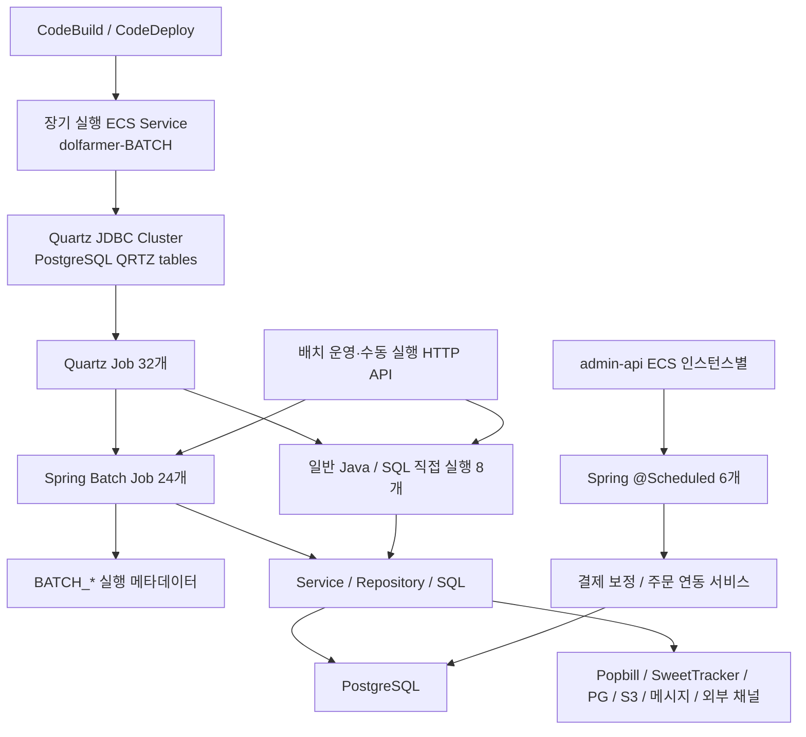

# Batch Platform 재설계 및 정책 검증

> 기존 Batch가 **어디서, 어떻게 실행되는지**부터 다시 파악하고, 스케줄링·실행 구조와 실제 데이터 정책을 함께 검증했습니다.

## 한눈에 보기

### 문제
외부 개발사 Butter의 기존 Batch는 **장기 실행 ECS Service 내부의 Quartz Scheduler**를 중심으로 동작하고 있었습니다. 여기에 `admin-api`의 `@Scheduled`, 수동 실행 HTTP API가 함께 존재했고, API 로직과 정기 처리 로직의 경계도 명확하지 않았습니다.

이후 AI를 활용해 Airflow / Spring Batch 구조로 재구성한 Job도 있었지만 주문·회원·통계 정책이 명확하지 않아, 단순히 코드가 실행되는지만으로는 올바른 Batch인지 판단하기 어려웠습니다.

### 판단
문제는 단순히 Quartz를 Airflow로 바꾸는 것이 아니었습니다.

- 스케줄링 책임을 애플리케이션에서 분리
- Batch 실행 시에만 컴퓨팅 리소스 사용
- 대량 처리에 적합한 데이터 접근 방식 선택
- 원천 데이터와 결과 데이터를 기준으로 정책 검증

이 네 가지를 같이 풀어야 한다고 판단했습니다.

### 한 일
- 백엔드 내부 Quartz Scheduler 대신 **Jenkins 또는 Airflow 기반 외부 스케줄링 구조** 제안
- 최종적으로 **EC2 Airflow → ECS Fargate → Spring Batch** 구조로 운영
- API 로직에 포함되어 있던 정기 처리 로직을 Batch Job으로 분리
- Spring Batch 애플리케이션을 상시 기동하지 않고 Job 실행 시 ECS Fargate Task로 기동
- Managed Airflow 비용을 고려해 EC2에 Apache Airflow 직접 구성
- Airflow·애플리케이션·DB 간 시간 해석 차이를 줄이기 위해 **Zero Offset 기준 통일 방안** 제안
- 대량 처리 시 JPA 영속성 컨텍스트의 메모리 사용과 flush/clear 관리 부담을 고려해 쿼리 중심 처리를 제안했고 최종 **MyBatis 채택**
- 코드·원천 데이터·결과 데이터를 비교해 집계 조건 검증
- 잘못된 상태값과 포함/제외 조건 수정
- 재실행·Backfill 시 데이터 중복·누락 여부와 멱등성 검증
- Docker + PostgreSQL + LocalStack 기반 로컬 반복 검증 환경 구성

### 결과
Batch를 단순히 **“백엔드 안에서 주기적으로 실행되는 코드”**가 아니라, **스케줄링·실행 환경과 도메인 정책이 분리되고 실제 데이터 기준으로 검증 가능한 Job**으로 정리하고 있습니다.

---

## 1. 기존 Butter Batch 구조를 먼저 역추적했습니다

기존 구조의 핵심은 하나의 Batch 애플리케이션에 **스케줄링, 실행, 실행 메타데이터, 비즈니스 로직**이 함께 들어가 있고, 별도로 `admin-api`에도 정기 작업이 존재했다는 점입니다.



Mermaid가 렌더링되지 않는 환경을 위한 동일 구조입니다.

```text
CodeBuild / CodeDeploy
        ↓
장기 실행 ECS Service: dolfarmer-BATCH
        ↓
Quartz JDBC Cluster (PostgreSQL QRTZ tables)
        ↓
Quartz Job 32개
   ├─ Spring Batch Job 24개 → BATCH_* 실행 메타데이터
   └─ 일반 Java / SQL 직접 실행 8개
                ↓
       Service / Repository / SQL
                ↓
           PostgreSQL
                ↓
 Popbill / SweetTracker / PG / S3 / 메시지 / 외부 채널

별도 흐름 1
admin-api ECS 인스턴스별
        ↓
Spring @Scheduled 6개
        ↓
결제 보정 / 주문 연동 서비스
        ↓
PostgreSQL

별도 흐름 2
배치 운영·수동 실행 HTTP API
   ├─ Spring Batch
   └─ 일반 Java / SQL
```

## 2. 이 구조에서 본 문제

### 스케줄러와 애플리케이션 생명주기가 결합돼 있었습니다
Quartz를 실행하기 위해 `dolfarmer-BATCH` ECS Service가 계속 떠 있어야 했습니다. 실제 Job이 실행되지 않는 시간에도 Batch 애플리케이션 자체는 장기 실행됩니다.

그래서 **스케줄링과 실행을 분리하고, Job이 필요할 때만 Batch Task를 실행하는 구조**가 더 적합하다고 봤습니다.

### 정기 실행 지점이 여러 곳에 흩어져 있었습니다

```text
Quartz
+
admin-api @Scheduled
+
수동 실행 HTTP API
```

어떤 작업이 어디서 시작되는지 한눈에 파악하기 어렵고, 스케줄 변경이나 장애 확인 시 확인 지점도 늘어납니다.

그래서 애플리케이션 밖에서 실행 시점과 상태를 관리하는 **Jenkins 또는 Airflow** 구조를 제안했고, 최종적으로 Airflow를 사용했습니다.

### API와 Batch의 책임이 섞여 있었습니다
일부 정기 처리가 API 서비스 로직 안에 포함되어 있었습니다. 요청·응답을 처리하는 API와 정기적으로 대량 데이터를 처리하는 Batch는 실행 특성이 다르기 때문에 해당 로직을 **독립적인 Batch Job으로 분리**했습니다.

### 데이터 접근 방식도 Batch 특성에 맞춰야 했습니다
대량 Batch에서 JPA를 사용할 경우 영속성 컨텍스트에 엔티티가 계속 쌓이지 않도록 flush/clear를 관리해야 하고, 단순 집계·갱신에서는 ORM의 장점보다 관리 비용이 커질 수 있다고 봤습니다.

그래서 **쿼리 중심 처리**를 제안했고 논의 끝에 MyBatis를 사용하게 되었습니다.

---

## 3. 제안하고 운영한 구조

```text
Apache Airflow (EC2)
        ↓
     Schedule
        ↓
   ECS RunTask
        ↓
 ECS Fargate Task
        ↓
   Spring Batch
        ↓
     MyBatis
        ↓
   PostgreSQL
        ↓
 Task 종료 상태 / Exit Code
        ↓
 Airflow 성공·실패 판단
```

처음부터 Airflow만 답이라고 정한 것은 아니었습니다. 기존 Quartz를 애플리케이션 내부에 유지하는 대신 **Jenkins 또는 Airflow처럼 애플리케이션 밖에서 Job을 스케줄링하는 구조**를 제안했습니다.

최종적으로 Airflow를 사용하면서 역할을 다음처럼 나눴습니다.

| 역할 | 담당 |
| --- | --- |
| 실행 시점 / 의존성 | Airflow |
| 실제 Batch 처리 | Spring Batch |
| 실행 컴퓨팅 | ECS Fargate Task |
| 데이터 접근 | MyBatis / SQL |
| 데이터 저장 | PostgreSQL |
| 로컬 검증 | Docker / PostgreSQL / LocalStack |

AWS Managed Airflow는 비용을 고려해 사용하지 않고 **EC2에 Apache Airflow를 직접 구성**했습니다.

## 4. 시간 기준도 하나로 맞추자고 제안했습니다
Scheduler, 애플리케이션, DB가 서로 다른 시간 기준을 사용하면 기준일·Backfill·자정 전후 실행에서 혼란이 생길 수 있습니다.

그래서 실행 파라미터와 시스템 간 시간 해석을 일관되게 하기 위해 **Zero Offset 기준으로 통일하는 방안**을 제안했습니다.

```text
Scheduler가 전달한 기준 시각
        =
Spring Batch가 해석한 기준 시각
        =
DB 조회 조건에서 사용하는 기준 시각
```

핵심은 특정 Timezone 이름이 아니라 **같은 기준 시각이 시스템마다 다르게 해석되지 않게 하는 것**이었습니다.

---

## 5. 구조를 바꾼 뒤에도 남은 문제는 정책이었습니다
실행 구조를 바꾼다고 Batch가 올바르게 동작하는 것은 아니었습니다.

주문·회원·통계 Job은 실제 집계 정책이 명확하지 않은 경우가 있었기 때문에 다음 순서로 검증했습니다.

```text
기존 Batch 코드 ─┐
                  ├→ 구현 조건 비교 → 정책 확인
원천 테이블 / 데이터 ┘
                          ↓
                    예상 결과 정의
                          ↓
                       Job 실행
                          ↓
                   결과 테이블 비교
                     ↙          ↘
                  불일치        일치
                    ↓            ↓
                 로직 수정   재실행 / Backfill
                    └──────→ 멱등성 확인
```

- 기존 구현이 어떤 조건으로 데이터를 읽는지 확인
- 실제 원천 데이터의 상태와 예외 확인
- 결과 테이블에 생성되는 값 비교
- 잘못된 상태값·포함/제외 조건 수정
- 같은 기준으로 다시 실행했을 때 결과가 달라지지 않는지 검증

코드가 `COMPLETED`가 되는 것과 **비즈니스적으로 올바른 결과를 만드는 것**은 다른 문제라고 봤습니다.

## 6. 재실행해도 안전한지 확인했습니다
Batch에서는 첫 실행 성공보다 **두 번째 실행이 어떻게 되는지**도 중요하게 봤습니다.

- 동일 기준일 재실행
- 실패 후 재실행
- Backfill
- 기존 집계 데이터가 이미 존재하는 상태
- 원천 데이터 조건이 바뀐 상태

검증 기준은 단순했습니다.

```text
첫 실행 결과
     =
두 번째 실행 결과
     =
동일한 원천 데이터에서 기대하는 결과
```

## 7. 로컬 검증 환경
운영 AWS 환경에 의존하지 않고 수정과 검증을 반복하기 위해 로컬 환경을 구성했습니다.

```text
Docker Compose
 ├─ PostgreSQL
 ├─ LocalStack
 ├─ Airflow / Scheduler
 └─ Spring Batch
```

목표는 운영 환경을 완전히 복제하는 것이 아니라 **데이터 생성 → Job 실행 → DB 확인 → 초기화**를 빠르게 반복하는 것이었습니다.

---

## 이 경험에서 중요하게 본 것

이번 작업에서는 두 층의 문제를 따로 봤습니다.

### Platform
> **“이 Job은 누가, 언제, 어디에서 실행해야 하는가?”**

### Policy
> **“이 Job이 만든 숫자는 어떤 데이터를 의미해야 하는가?”**

Quartz를 Airflow로 바꾸는 것만으로는 충분하지 않았고, 반대로 정책만 바로잡아도 실행 구조가 복잡하면 운영하기 어렵습니다.

그래서 **기존 구조를 먼저 이해하고 → 실행 책임을 분리하고 → 실제 데이터로 정책을 검증하는 순서**로 Batch를 정리하고 있습니다.
