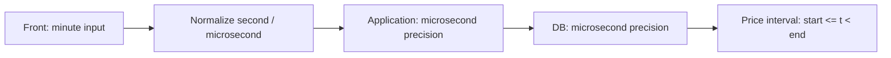
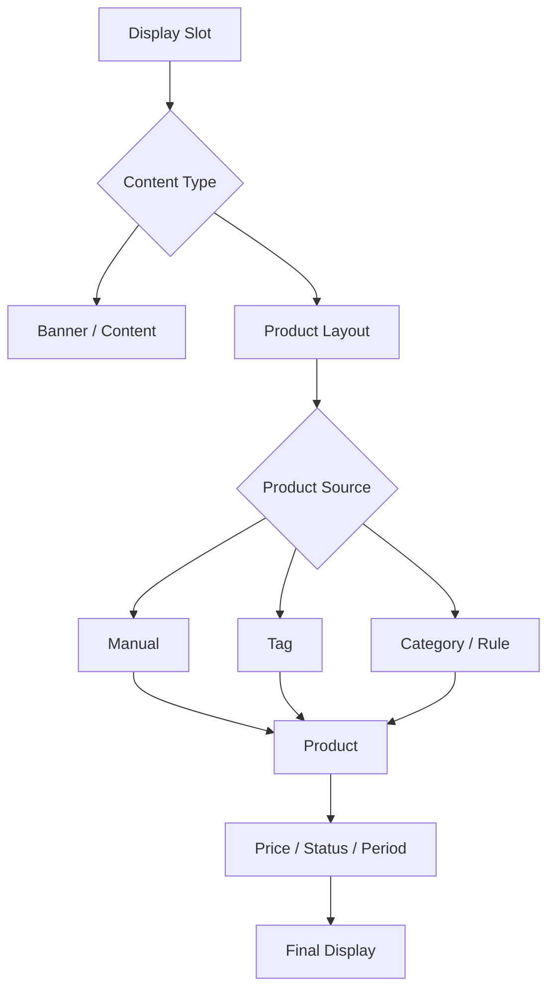

# 한정원 · Backend Engineer

**총 경력 약 5년 5개월 · Java/Spring 5년+ · Commerce Product · User · Display**  
지원: **카카오스타일 전시 시스템** · devwonny@gmail.com · [github.com/dev-wonny](https://github.com/dev-wonny)


- **도메인** — 상품·유저·전시 정책을 코드·DB·API·화면까지 연결해 정의
- **AI** — 구현엔 적극 활용하고, 검증 기준은 사람이 먼저 정의해 실제 데이터로 확인
- **규모** — DAU 약 **123만** 서비스 Backend 개발·운영, AWS 배포·운영

## ZIGZAG 전시 영역과 연결되는 경험

| ZIGZAG 영역 | 연결되는 경험 |
| --- | --- |
| **홈 / 전시** | 레이아웃·배너·상품형 전시 노출 흐름 검증 |
| **PLP / 상품** | 상품 상태·가격·기간·삭제 정책, 가격 이력 경계 |
| **찜 / 북마크** | Wishlist 삭제 정책, 연관 데이터 수명주기 |
| **추천 / 랭킹** | 기간별 사전 집계 기반 추천 Serving |
| **운영 도구** | Shop / Admin / Batch 공통 정책·데이터 계약 |

**기술 스택:** Java · Spring Boot · Spring Batch · JPA/QueryDSL · MyBatis · PostgreSQL · AWS · Kafka  
전체 스택은 하단에 정리했습니다.

---

# Experience

## DS GLOBAL

**개발팀 과장 · Backend Engineer**  
**2026.01 — Present**

레거시 쇼핑몰을 신규 커머스 플랫폼으로 전환하는 과정에서 **상품 · 유저 · 전시 영역**을 담당하고 있습니다. 기존 외부 구현을 인수·검증하는 업무와 직접 수정·개발한 업무를 구분해 관리하며, 정책과 구현이 다를 때 데이터의 의미와 도메인 경계부터 다시 정의합니다.

### 1. AI 기반 Wishlist 리빌딩 검증 → 상품 삭제 정책 공통 적용

**Java · Spring Boot · JPA / QueryDSL · PostgreSQL · Spring Batch**

AI를 활용해 리빌딩한 Wishlist 영역에서 **Soft Delete 정책과 연관 조회·집계 조건이 서로 일치하지 않아** 사용자 찜 상태와 상품별 집계 결과가 달라지는 문제를 발견했습니다.

단순히 누락된 삭제 조건을 추가하지 않고 “현재 찜 상태만 필요한가, 이력까지 필요한가”부터 다시 정의했습니다.

- 현재 상태가 핵심인 Wishlist에는 **Hard Delete**가 더 단순한 모델이라고 판단
- 상품 삭제 시 연관 Wishlist도 함께 정리하도록 데이터 수명주기 정책 정의
- 상품 삭제 판정이 여러 기준으로 나뉘어 있던 문제를 정리해 **Shop / Admin이 동일한 삭제 기준을 사용하도록 팀·개발리더와 합의·적용**
- 향후 이력이 실제 요구사항이 되면 현재 상태 테이블에 삭제 상태를 누적하기보다 별도 History 모델로 분리하도록 방향 정리

#### 성능 / 집계 개선 관점

현재 상품별 찜 수는 일 단위 Batch 재집계에 의존합니다. 찜은 `추가 / 해제`라는 명확한 이벤트가 있으므로 **변경 시 증분 반영하고, Batch는 Reconciliation 용도로 사용하는 구조**가 더 적합한지 검토하고 있습니다.

```text
Wish Add / Remove
      ↓
Incremental Count
      ↓
Display / Ranking
      ↑
Periodic Reconciliation
```

이 사례는 **AI가 만든 코드를 검토한 경험이 아니라, AI가 빠르게 만든 구조에서 도메인 의미가 빠졌을 때 어떤 문제가 생기는지 발견하고 조직의 공통 정책까지 정리한 경험**입니다.

---

### 2. 상품 가격 Temporal Policy 설계

**Java · Spring Boot · JPA · PostgreSQL · Temporal Data Modeling**

상품 가격 이력은 특정 값 하나가 아니라 **유효 기간을 가진 상태**이므로, 경계 정의가 잘못되면 같은 순간에 두 가격이 동시에 유효하거나 어느 가격도 유효하지 않은 구간이 생길 수 있습니다.

- 가격 유효 구간을 **반개구간 `[start, end)`**으로 정의
- 조회 조건을 `start_at <= t AND t < end_at`로 통일
- Application과 DB 모두 **마이크로초 정밀도**를 동일하게 유지
- 화면은 분 단위 입력이므로 입력되지 않는 초·마이크로초는 고정값으로 정규화
- Front → API → Application → DB가 같은 시간 의미를 사용하도록 데이터 계약 정의



예를 들어 이전 가격 `[10:00, 11:00)`, 다음 가격 `[11:00, 12:00)`이라면 **11:00에는 다음 가격만 유효**합니다.

이 사례에서는 컬럼 타입보다 **상품 가격이라는 비즈니스 상태를 시간축에서 어떻게 표현할지**를 먼저 정하고, UI와 DB까지 같은 기준을 사용하도록 정책화했습니다.

#### 현재 상태 조회와 과거 거래 재현 분리

포인트 정책에서도 같은 기준을 적용했습니다.

- 현재 회원등급은 현재 회원 → 현재 등급 정책을 조회
- 과거 주문은 **주문 당시 회원등급과 당시 정책**을 재현할 수 있어야 함
- 회원의 등급 변경 이력만으로는 당시 등급의 적립률·정액 정책 변경까지 복원할 수 없으므로 **주문 Snapshot 또는 Tier Policy Versioning** 중 하나가 필요하다고 정리
- 최종 지급 포인트는 수량 변경·취소·회수·재지급으로 변할 수 있어, 현재 구조에서는 지급 시점에 유효 상태를 기준으로 재계산하는 방향으로 개발리더와 결정

즉 **현재 상태 조회와 과거 거래 재현은 서로 다른 문제**로 보고 설계합니다.

---

### 3. Batch 집계 오류 직접 수정 및 데이터 정합성 검증

**Spring Batch · Java · MyBatis · PostgreSQL · Airflow · Docker · LocalStack**

운영 검증 대상 Batch Job **41개**를 기준으로 원천 데이터와 집계 결과를 비교하고, 잘못된 로직은 직접 수정해 반복 실행으로 검증하고 있습니다.

#### 회원 구매 집계 오류 수정

회원별 구매 집계가 구매 이력이 있는 회원을 기준으로 시작해 **미구매 정상 회원의 Summary가 생성되지 않는 문제**를 발견했습니다.

- 정상 회원 전체를 기준으로 집계 결과를 `LEFT JOIN`하도록 MyBatis Query 수정
- 구매 이력이 없는 정상 회원도 `0 / 0` Summary를 갖도록 보정
- 테스트 데이터와 기대 결과를 먼저 정의
- JUnit 골든 테스트 + 실제 애플리케이션 로컬 E2E 반복 실행
- 동일 기준일 재실행 시 결과가 변하지 않는지 멱등성 검증

서비스 API에서는 JPA / QueryDSL을 사용하고, 집계 Batch에서는 기존 MyBatis 기반의 명시적인 SQL을 직접 검증·수정합니다. **도메인 모델링과 대량 집계의 성격에 따라 데이터 접근 방식을 구분**합니다.

---

### 4. Display / Recommendation 시스템 인수 및 정책 재정의

**Java · Spring Boot · JPA · QueryDSL · PostgreSQL · Spring Batch**

외부 개발사가 구현한 전시 시스템을 내재화하면서 홈·배너·상품형 전시와 추천 상품의 실제 데이터 흐름을 검증하고, 운영 확장 관점에서 필요한 정책을 정리했습니다.



#### 전시

- 홈 전시를 콘텐츠형 / 룰 기반 / 상품 직접매핑 / 상품 소스 분기형으로 분류
- 상품 상태·게시 기간·유효 가격·할인 여부 등 최종 노출 조건 검증
- Preview 기능은 구체적인 내부 접근 방식 대신 **접근 제어 정책을 명시적으로 정의할 필요가 있는 지점**을 정리

#### 추천

- 랜덤 / 누적 주문수량 / 누적 주문금액 기준과 기간별 사전 집계 사용 여부 검증
- 판매가·노출 수·활성 여부가 실제 Query에 반영되는지 확인
- 화면에 존재하지만 실제 조회에서는 사용되지 않는 정책, 화면/서버 옵션 불일치 등 Gap 식별
- 추천 상품의 **Selection Policy와 Presentation Policy를 분리**해 운영자가 Slider / Grid / Card 형태를 확장할 수 있는 구조 제안

#### 성능 관점

현재 랜덤 추천은 후보 상품 전체를 DB에서 랜덤 정렬한 뒤 `limit`하는 방식이라 상품 규모가 커질수록 비용이 커질 수 있습니다. 개선 시에는 **후보군 축소, 사전 샘플링, 별도 후보 집합 관리 등 조회 시 전체 정렬을 피하는 방향**을 검토할 수 있다고 정리했습니다.

---

### 5. 쇼핑몰 이벤트 플랫폼 개발·배포·운영

**2026.03 — 2026.04**  
**Spring Boot · PostgreSQL · AWS ECS(EC2) · ALB · CodePipeline · CodeBuild · CodeDeploy · ELK**

출석·랜덤 리워드·응모권 이벤트를 외부 솔루션 없이 내부에서 운영할 수 있도록 Backend를 직접 개발했습니다.

- 이벤트 참여·보상·응모권 API 개발
- 이벤트 유형별 상태 변화와 보상 정책 구현
- ECS(EC2) 환경 배포 및 운영
- CodePipeline · CodeBuild · CodeDeploy 기반 배포
- ELK 기반 로그 및 운영 오류 확인

#### 운영 결과

- MAU 약 **16만**, DAU 약 **9,700**
- 7일 이벤트 총 응모 **10,950건**
- 참여 회원 **6,305명**


---

### 6. Commerce Product / Image Migration

**MSSQL · PostgreSQL · AWS S3 · CloudFront**

레거시 쇼핑몰과 발주·배송·정산 시스템의 상품·이미지 데이터를 신규 커머스 플랫폼으로 전환했습니다.

- 판매 상품과 공급 상품의 실제 관계와 매핑 기준 분석
- 원본 이미지 **15,736건**, 생성·변환 이미지 **73,401건**, HTML 이미지 URL **5,053건** 검증
- 마이그레이션 추적 경로와 신규 운영 이미지 경로 분리
- Resize, 원본 보존, Temp 이미지 처리 기준 정리

---

## AI-assisted Development Workflow

AI를 단순 코드 생성기로 쓰지 않고 **개발 Workflow의 일부로 설계**해 사용합니다.

- 코드 탐색·반복 구현·문서/정책 비교에 AI Agent 활용
- 반복되는 아키텍처 제약·코드 컨벤션·검증 기준을 재사용 가능한 지침으로 관리
- AI가 생성한 구현을 원천 데이터·기존 정책·테스트 결과와 비교
- 기대 결과를 먼저 정의하고 실제 실행 결과가 다르면 원인을 다시 추적
- 여러 영역을 병렬로 조사한 뒤 사람이 최종 도메인 기준과 trade-off를 결정

**AI가 구현을 맡을 수 있어도, 무엇이 올바른 구현인지 판단하는 책임까지 넘길 수는 없다고 생각합니다.**

---

## DoubleDown Interactive

**서비스개발팀 매니저 · 2022.10 — 2024.04**

DAU 약 **123만** 규모의 글로벌 소셜카지노 게임 서비스에서 Java/Spring Backend API와 운영 플랫폼을 개발했습니다.

### Backend / Operations

- 게임 Backend API 개발·운영
- 광고 처리 구조의 조건 분기를 Strategy Pattern으로 분리
- 광고팀 측정 지표 기준 정책 개선 후 **CTR 약 25% 향상**
- Spring Batch 기반 광고 이메일 업무 자동화로 수작업 시간 약 **90% 감소**
- Jenkins 및 AWS 환경의 서비스 생성·배포·운영

### Cache / Read Optimization

외부 Deeplink / Short URL 기능을 내부 플랫폼으로 전환하면서 DynamoDB 반복 조회 구간에 Local Cache를 적용했습니다.

- 반복 조회 데이터를 캐시해 원격 저장소 접근 횟수를 줄이는 구조 적용
- DynamoDB 접근량 약 **30% 감소**
- 운영자가 Admin에서 직접 링크를 생성·관리할 수 있도록 Self-service화

캐시 적용 시에는 **조회 빈도와 변경 빈도를 함께 보고, 변경 가능성이 낮고 반복 조회가 많은 데이터를 캐시 대상으로 선정**했습니다.

---

## Future Platform

**서비스개발팀 팀장 · 2025.06 — 2025.12**

식품의약품안전처 폐쇄망 프로젝트에서 Java/Spring 기반 Backend 개발과 개발 환경 개선을 담당했습니다.

- Java 8 · Spring 4.x · MyBatis 기반 시스템 개발
- 폐쇄망 환경의 실행·배포 절차와 라이브러리 관리 기준 정리
- 신규 개발자 온보딩을 위한 개발·배포 문서화

---

## AdMax / FSN

**R&D팀 매니저 · 2020.01 — 2022.08**

한국·대만에서 운영되는 디지털 광고 서비스의 Tracking 및 FDS Backend를 담당했습니다.

- Click Server, Action Server, Batch Job 등 광고 Tracking Backend 유지보수 및 기능 개발
- YouTube · Instagram · Facebook 데이터 3분 단위 자동 수집
- HashMap 기반 중복 방지 및 수집 검증으로 **수집 정확도 90% 이상 유지**
- 불필요한 요청 패턴을 추적·필터링해 **요청량 약 20% 감소**
- 트래픽 특성을 기준으로 Scale-up 전략을 적용해 **인프라 비용 약 20% 절감**
- Scheduled Job · Telegram 기반 이상 감지 및 운영 자동화

---

# Architecture / MSA Experience

실무에서는 Shop · Admin · Batch 등 분리된 애플리케이션이 **동일한 상품 정책과 데이터 계약을 사용하도록 경계를 정리**한 경험이 있습니다. 이를 MSA 실무 경험으로 과장하지 않고, 서비스 간 계약과 일관성 문제를 다룬 경험으로 구분합니다.

개인 프로젝트 **Coopang**에서는 MSA 기반 커머스 주문 플랫폼을 직접 설계·구현했습니다.

- Gateway, 서비스 분리, Kafka 기반 이벤트 처리
- 주문 상태별 트랜잭션 책임 분리
- JPA / QueryDSL 기반 도메인 모델과 조회 로직
- PostgreSQL · Redis · Docker 기반 로컬 통합 환경
- Grafana · Loki 기반 관측성 구성


---

# Core Skills

- **Backend**: Java, Spring, Spring Boot, Spring Batch, MyBatis, JPA, QueryDSL
- **Commerce Domain**: Product, User, Display, Recommendation Policy, Wishlist, Point, Event, Migration
- **Data**: PostgreSQL, MySQL, MSSQL, Oracle, Redis, DynamoDB
- **Cloud / Runtime**: AWS EC2, ECS(EC2/Fargate), ALB/ELB, S3, CloudFront, Route53, CloudWatch
- **Delivery / Operations**: CodePipeline, CodeBuild, CodeDeploy, Jenkins, Docker, Airflow, ELK
- **Messaging**: Kafka (실무 및 개인 프로젝트)
- **Personal Project / Observability**: GitHub Actions, Prometheus, Grafana, Loki

---

# How I Work

### 데이터의 의미와 경계를 먼저 정의합니다

Soft Delete, 가격 시간 경계, 거래 Snapshot처럼 구현 세부사항으로 보이는 문제도 결국 **도메인이 어떤 상태와 이력을 필요로 하는지**의 문제라고 생각합니다.

### 현재 상태와 과거 거래 재현을 분리합니다

현재 회원 상태는 현재 데이터를 조회하고, 과거 거래는 당시 정책을 재현할 근거를 별도로 보존해야 합니다. 현재 상태 조회와 거래 불변성을 같은 방식으로 풀지 않습니다.

### 발견에서 끝내지 않습니다

직접 수정할 수 있는 문제는 코드 수정과 반복 검증까지 하고, 정책 결정이 필요한 문제는 대안과 trade-off를 정리해 동료와 합의하고 **여러 서비스가 같은 규칙을 사용하도록 공통 기준으로 만드는 것**까지 포함합니다.

### AI 결과도 검증 가능한 코드로 봅니다

AI가 만든 코드도 원천 데이터, 정책, 테스트 결과로 검증합니다. 실행 성공보다 **올바른 결과를 만드는지**를 더 중요하게 봅니다.

---

# Education / Career Transition

- **2016** · 대학 졸업
- **2016 — 2019** · 공무원 시험 준비 후 소프트웨어 개발자로 진로 전환
- **2020 — Present** · Backend Engineer
