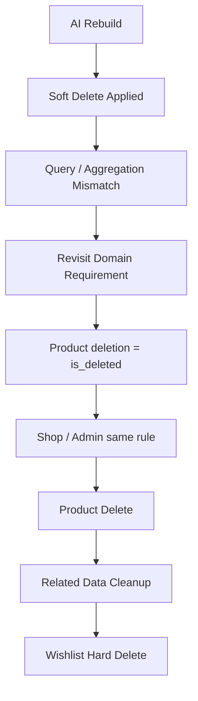
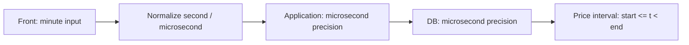
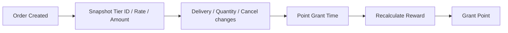
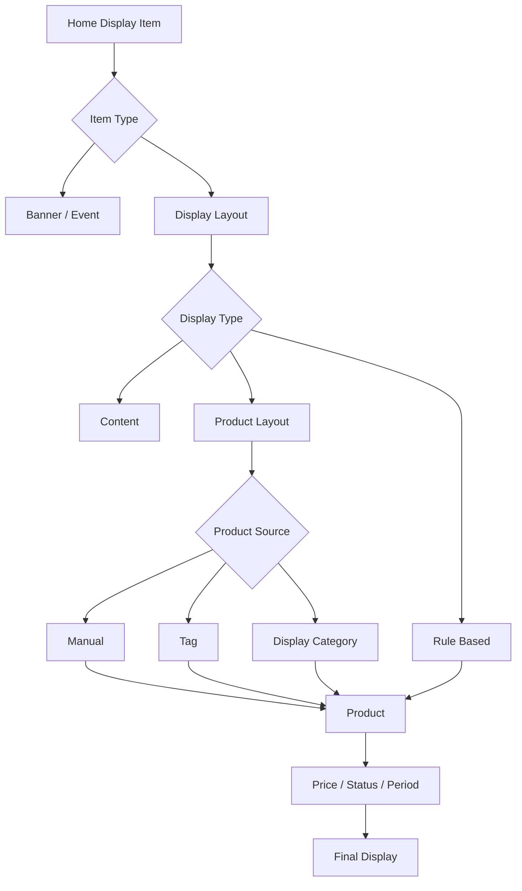
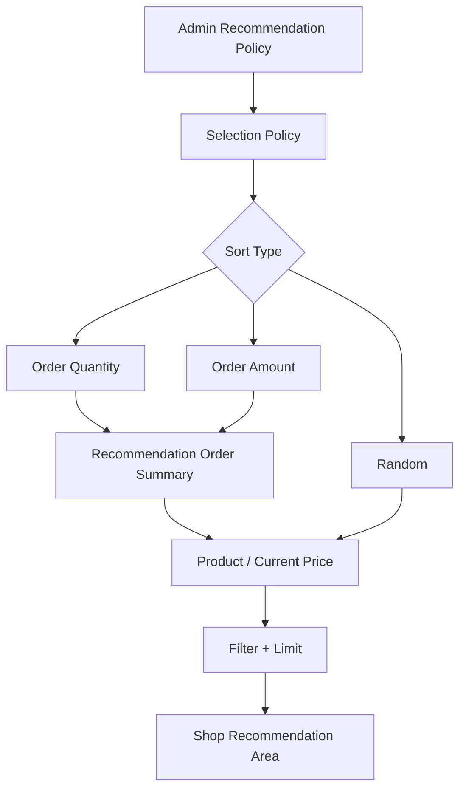
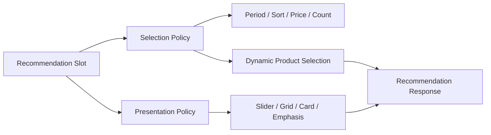

# 한정원

**Backend Engineer · Commerce Product / User / Display**  
**지원 포지션: 카카오스타일 백엔드 개발자 (전시 시스템)**

Email. devwonny@gmail.com · GitHub. [github.com/dev-wonny](https://github.com/dev-wonny)


Java/Spring 기반으로 백엔드 서비스를 개발해 왔으며, 현재는 커머스 플랫폼의 **상품 · 유저 · 전시 영역을 담당**하고 있습니다.

상품 가격과 노출 조건, 사용자의 찜 상태, 홈·추천 상품처럼 고객이 실제로 마주하는 데이터가 **어떤 정책과 시간 경계를 기준으로 저장되고 조회되는지**를 코드·DB·API·화면까지 연결해서 봅니다. 요구사항과 실제 동작이 다르면 Query 하나만 고치는 데 그치지 않고 데이터의 수명주기와 도메인 경계부터 다시 정의합니다.

최근에는 AI 기반 리빌딩 과정에서 Wishlist의 Soft Delete와 집계 조건 불일치를 발견해 삭제 정책을 다시 정리했고, 팀과 개발리더를 설득해 **Shop과 Admin 모두 상품 삭제 기준을 `is_deleted`로 통일하고, 상품 삭제 시 연관 데이터를 함께 정리하는 공통 정책**으로 합의·적용했습니다. 상품 가격 이력에서는 **반개구간 `[start, end)`과 마이크로초 정밀도를 DB와 Application에 동일하게 적용하고, 고객 입력이 분 단위인 화면에서는 초·마이크로초를 고정값으로 정규화하는 정책**을 정의했습니다.

포인트 지급 정책에서는 주문 당시 회원등급 정책을 보존하기 위해 등급 ID와 지급 비율·정액값은 주문 시점에 Snapshot으로 저장하되, 최종 지급 예정 포인트는 수량 변경·취소·재지급 가능성을 고려해 저장하지 않고 **지급 시점에 다시 계산**하는 방향으로 개발리더와 결정했습니다.

동시에 Spring Batch 집계 오류를 Java/MyBatis에서 직접 수정하고, 출석·랜덤 리워드·응모권 이벤트 Backend를 직접 개발·배포·운영하는 등 **분석에서 끝나지 않고 실제 코드 수정과 운영까지 수행**해 왔습니다.

이전에는 DAU 약 **123만** 규모의 글로벌 게임 서비스에서 Backend API와 운영 플랫폼을 개발했으며, AWS 환경 생성·배포·운영까지 서비스개발팀에서 함께 담당했습니다.

---

## 카카오스타일 전시 시스템과 연결되는 경험

### Product / User Domain Problem Solving

- 상품 · 유저 · 전시 영역을 담당하며 고객에게 노출되는 상품 데이터와 사용자 상태의 정책·정합성 검증
- Wishlist Soft Delete로 현재 찜 상태와 상품별 집계 조건이 어긋나는 문제를 발견하고 팀·개발리더와 논의해 **Hard Delete + 상품 삭제 시 연관 Wishlist 정리** 정책으로 합의
- Shop / Admin의 상품 삭제 판정 기준을 `product_status_code = DELETED`에서 **`is_deleted`로 통일**해 동일한 도메인 규칙을 적용
- 상품 가격 이력의 경계 중복/누락을 막기 위해 **반개구간 `[start, end)`** 정책 정의
- 가격 이력의 Application/DB 시간 정밀도를 **마이크로초 단위로 통일**하고 화면의 분 단위 입력은 초·마이크로초를 고정값으로 정규화하도록 기준 수립
- 주문 당시 회원등급 정책은 Snapshot으로 보존하되, 변동 가능한 최종 포인트는 저장하지 않고 지급 시점에 재계산하도록 정책 결정

### AI + Commerce Domain Engineering

- AI 기반 리빌딩 결과를 그대로 수용하지 않고 실제 도메인 정책·연관 데이터·집계 결과와 비교해 문제 식별
- AI로 재구현된 Spring Batch Job을 기존 코드·원천 데이터·서비스 정책과 비교해 검증 및 수정
- 코드 탐색, 반복 구현, 문서 분석에 AI Agent 활용
- 생성된 코드를 실행 성공으로 완료 처리하지 않고 기대 결과와 실제 데이터로 재검증

### Commerce Display / Recommendation

- 외부 개발사가 구현한 전시 시스템을 내재화하며 홈·배너·상품형 전시의 실제 데이터 흐름 검증
- 추천 상품의 랜덤 / 누적 주문수량 / 누적 주문금액 정책과 기간 집계·가격·노출 수 조건의 Query 반영 여부 검증
- Admin 설정 → Backend → DB → Shop API → 실제 화면까지 전체 흐름 기준으로 정책과 구현의 차이 식별
- 추천 상품의 **Selection Policy와 Presentation Policy를 분리**해 운영 확장성을 확보하는 구조 제안

### Implementation / Operations

- 회원 구매 집계 Batch에서 미구매 정상 회원의 Summary가 생성되지 않는 문제를 발견하고 **Java/MyBatis 로직 수정 및 로컬 E2E 반복 검증**
- 출석·랜덤 리워드·응모권 이벤트 Backend API 직접 개발
- AWS ECS(EC2) 환경 배포 및 운영, CodePipeline · CodeBuild · CodeDeploy 기반 배포
- 주문·회원·상품 Batch의 재실행·Backfill 시 중복/누락과 멱등성 검증

### Architecture / MSA

- 개인 프로젝트 **Coopang**에서 MSA 기반 커머스 주문 플랫폼 설계·구현
- Gateway, 서비스 분리, Kafka 기반 이벤트 처리, 주문 상태별 트랜잭션 구조 설계
- JPA / QueryDSL 기반 도메인 모델링과 PostgreSQL, Redis, Docker 기반 로컬 환경 구성
- Grafana / Loki 기반 관측성 환경 구성

---

## Core Skills

- **Backend**: Java, Spring, Spring Boot, Spring Batch, MyBatis, JPA, QueryDSL
- **Commerce Domain**: Product, User, Display, Recommendation Policy, Wishlist, Point, Event, Migration
- **Data**: PostgreSQL, MySQL, MSSQL, Oracle, Redis, DynamoDB
- **Cloud / Runtime**: AWS EC2, ECS(EC2/Fargate), ALB/ELB, S3, CloudFront, Route53, CloudWatch
- **Delivery / Operations**: CodePipeline, CodeBuild, CodeDeploy, Jenkins, Docker, Airflow, ELK
- **Messaging**: Kafka (실무 및 개인 프로젝트)
- **Personal Project / Observability**: GitHub Actions, Prometheus, Grafana, Loki

---

# Experience

## DS GLOBAL

**개발팀 과장 · Backend Engineer**  
**2026.01 — Present**

레거시 쇼핑몰을 신규 커머스 플랫폼으로 전환하는 과정에서 **상품 · 유저 · 전시 영역을 담당**하고 있습니다. 상품 가격·노출 정책, 사용자 상태, 추천/전시 데이터, 포인트·이벤트 Backend와 Batch 데이터 검증, AWS 실행 환경, 데이터·이미지 마이그레이션을 함께 다루고 있습니다.

### 1. AI 기반 Wishlist 리빌딩 검증 및 상품 삭제 정책 통일

**Java · Spring Boot · JPA / QueryDSL · PostgreSQL · Spring Batch**

AI를 활용해 리빌딩한 Wishlist 영역에서 개발 과정 중 적용된 **Soft Delete 정책과 연관 테이블의 조회·집계 조건이 서로 일치하지 않아**, 사용자 찜 상태와 상품별 집계 결과가 달라지는 문제를 발견했습니다.

이 문제를 단순히 누락된 `deleted` 조건을 추가하는 문제로 보지 않고, 먼저 **Wishlist가 어떤 데이터를 보존해야 하는 도메인인지**부터 다시 검토했습니다.

#### 문제를 다시 정의한 기준

- 현재 요구사항은 사용자의 **현재 찜 상태**가 핵심이며, 찜 생성·해제 이력을 장기 보존해 사용하는 기능은 없음
- Soft Delete를 적용하면 모든 조회·집계·추천 로직이 동일한 삭제 조건을 지속적으로 따라야 함
- 상품 삭제 시 Wishlist 관계가 남으면 고객 찜 목록과 상품별 찜 집계가 서로 다른 의미를 가질 수 있음
- 이력이 실제 비즈니스 요구라면 현재 상태 테이블에 삭제 row를 누적하기보다 **현재 상태와 History의 책임을 분리**하는 편이 명확함
- 기존에는 상품 삭제 여부를 `product_status_code = DELETED`와 `is_deleted`가 혼재해 판단하고 있어 Shop/Admin/Batch 간 조건 불일치 가능성이 있었음

#### 팀과 합의해 공통 적용한 정책

- 상품 삭제 여부는 **`product.is_deleted`를 단일 기준으로 사용**하고 `product_status_code = DELETED` 의존 제거
- 동일 기준을 **Shop과 Admin에 공통 적용**해 상품 삭제의 의미를 하나로 통일
- 상품 삭제 시 해당 상품을 참조하는 연관 데이터를 함께 정리
- `member_product_wish`는 이력 요구가 없는 현재 정책에 맞춰 **물리 삭제(Hard Delete)**
- 향후 행동 이력이 실제 요구사항이 되면 현재 상태 테이블을 Soft Delete하는 대신 별도 History 모델을 두는 방향으로 분리

개인 의견으로 끝내지 않고 문제와 대안을 정리해 팀과 개발리더에게 설명했고, **Shop/Admin이 동일한 삭제 규칙을 사용하도록 공통 정책으로 합의·반영**했습니다.

상품별 찜 수 집계는 현재 일 단위 Batch 재집계 방식이지만, 찜 추가/해제 시 증분 반영하고 Batch는 정합성 보정(Reconciliation) 용도로 사용하는 방향도 후속 개선안으로 검토하고 있습니다.



이 사례에서 AI는 기존 방식을 빠르게 재구현하는 도구로 활용했지만, **생성된 구조가 실제 도메인 의미와 맞는지는 별도로 검증해야 한다**고 판단했습니다. 관례적인 Soft Delete보다 현재 상태·이력·연관 데이터의 수명주기를 명확히 정의하고, 여러 애플리케이션이 같은 도메인 규칙을 사용하도록 정리했습니다.

---

### 2. 상품 가격 이력의 시간 경계·정밀도 정책 설계

**Java · Spring Boot · JPA · PostgreSQL · Temporal Data Modeling**

상품 가격은 특정 시점의 값 하나가 아니라 **유효 기간을 가진 이력 데이터**입니다. 가격 변경 시점의 경계를 잘못 정의하면 같은 순간에 두 가격이 동시에 유효해지거나, 반대로 어느 가격도 적용되지 않는 구간이 생길 수 있습니다.

기존 논의에서 초 단위로 단순화하는 방향도 있었지만, Application만 정밀하게 처리하고 DB가 다른 정밀도를 가지면 저장·조회 결과가 다시 어긋날 수 있다고 판단했습니다. 그래서 **Application과 DB 모두 동일한 마이크로초 정밀도를 유지**하는 정책을 정리했습니다.

#### 정의한 정책

- 가격 유효 구간은 양끝을 모두 포함하는 `BETWEEN` 대신 **반개구간 `[start, end)`** 사용
- 조회 조건은 `start_at <= t AND t < end_at`로 통일해 인접한 가격 이력 사이의 중복을 방지
- 가격 시간값은 Application과 PostgreSQL 모두 **마이크로초 정밀도**를 동일하게 유지
- 고객/운영 화면은 분 단위로 시간을 입력하므로, 화면에서 입력되지 않는 **초와 마이크로초는 정책상 고정값으로 정규화**
- Front → API → Application → DB가 서로 다른 시간 단위를 해석하지 않도록 동일한 시간 계약으로 관리



예를 들어 이전 가격의 `end_at`과 다음 가격의 `start_at`이 같은 시각이라면:

```text
이전 가격  [10:00, 11:00)
다음 가격  [11:00, 12:00)
```

`11:00`에는 다음 가격만 유효합니다. 경계 시각에 두 가격이 동시에 선택되거나 누락되지 않습니다.

이 경험은 단순 컬럼 타입 선택이 아니라 **상품 가격이라는 비즈니스 상태를 시간축에서 어떻게 표현할지, 그리고 UI·Application·DB가 동일한 의미를 유지하도록 어떤 계약을 둘지 정책을 세운 사례**입니다.

---

### 3. 주문 시점 회원등급 Snapshot과 포인트 계산 책임 설계

**Java · Spring Boot · PostgreSQL · Domain Policy**

구매 포인트는 “지급 시점의 회원등급”이 아니라 **주문 당시 적용된 회원등급 정책**을 기준으로 계산해야 했습니다. 주문 이후 회원등급이나 등급별 지급 정책이 바뀌더라도 과거 주문의 지급 기준은 변하면 안 되기 때문에, 계산의 근거가 되는 정책값을 주문 시점에 보존하도록 구조를 정리했습니다.

#### 주문 시점에 보존하도록 정의한 값

`order_item_post_delivery`에 다음 값을 Snapshot으로 보존하도록 제안했습니다.

- `member_tier_id`: 주문 당시 회원등급
- `member_tier_receive_point_rate`: 주문 당시 등급별 비율 포인트
- `member_tier_receive_point_amount`: 주문 당시 등급별 정액 포인트

현재 회원정보나 최신 `member_tier`를 지급 시점에 다시 조회하지 않고, **주문 당시 확정된 정책의 입력값을 보존**하는 것이 핵심입니다.

#### 저장하지 않기로 한 값

초기에는 최종 지급 예정 포인트인 `point_reward_amount`도 주문 시점에 계산해 저장하는 방안을 제안했습니다.

하지만 개발리더와 검토하면서 다음 변경 가능성을 확인했습니다.

- 배송 전후 주문 수량이 변경될 수 있음
- 일부/전체 취소가 발생할 수 있음
- 포인트 지급 후 취소로 회수하고 다시 지급해야 하는 경우가 생길 수 있음

따라서 최종 지급액까지 미리 저장하면 상태 변경 때마다 파생값을 계속 갱신해야 하고, 원천 상태와 계산 결과가 어긋날 가능성이 커집니다. 이에 따라 **주문 당시 정책 Snapshot만 저장하고, 실제 지급액은 지급 시점의 유효 수량·취소 상태와 Snapshot 정책을 이용해 계산**하는 것으로 결정했습니다.



이 사례에서는 무엇을 저장할지보다 **변하지 않아야 하는 입력값과 계속 변할 수 있는 파생값을 구분**했습니다. 처음 제안한 `point_reward_amount`를 고집하지 않고, 개발리더와 상태 변화 시나리오를 검토한 뒤 더 단순하고 정합성을 유지하기 쉬운 방향으로 설계를 수정했습니다.

---

### 4. Commerce Display System 인수·검증

**Java · Spring Boot · JPA · QueryDSL · PostgreSQL**

홈 화면에 노출되는 레이아웃과 배너, 이벤트, 상품 영역은 외부 개발사가 구현한 시스템을 내재화하는 과정에서 담당하게 되었습니다. 전시관리 화면만 확인하지 않고 Backend 코드, DB 관계, API Response와 Shop 화면을 함께 따라가며 실제 노출 구조와 운영 제약을 검증했습니다.



#### My Role

- 홈 전시의 실제 사용 유형을 **콘텐츠형 / 룰 기반 / 상품 직접매핑 / 상품 소스 분기형**으로 분류
- Editor, Review, Grade, Price Sale, Time Sale, Custom, Emphasis 등 전시 유형별 데이터 흐름 분석
- 수동 상품 지정, Tag, Display Category 등 상품 소스별 조회 조건 확인
- 상품 상태·게시 기간·유효 가격·할인 여부 등 최종 노출 조건 검증
- Admin 설정값과 실제 Shop 노출 결과가 다를 경우 Backend Query까지 추적
- 미구현 또는 일부만 동작하는 전시 유형과 운영 제약을 식별해 내재화 기준으로 문서화

이 영역은 외부 구현을 인수·검증하는 과정이므로, **직접 구현 완료한 내용과 분석·개선 제안은 구분해서 관리**하고 있습니다.

---

### 5. Display Preview Policy 검증

전시 운영자가 공개 전 콘텐츠를 확인하는 Preview 기능에서 노출 OFF·노출 기간 전후 콘텐츠가 어떤 조건까지 우회되고, 어떤 상품 조건은 그대로 유지되는지 확인했습니다.

#### 확인한 문제

- 전시 활성 상태는 Preview에서 완화되지만 상품 자체의 판매·게시·가격 조건은 유지될 수 있어 Preview의 의미가 영역별로 달라질 수 있음을 확인
- 일반 Shop 접근과 Admin Preview 접근을 구분하는 기존 방식이 강한 인증·인가 수단은 아니라는 점 확인
- 홈 레이아웃과 상단 메뉴 등 Preview 진입점별 정책 적용 범위 비교

#### My Role

- “관리자만 확인 가능”이라는 요구사항을 실제 Backend 접근 제어 로직과 비교
- Preview에서 우회되는 전시 조건과 유지되는 상품 조건을 분리해 정리
- 화면만 확인하지 않고 접근 제어와 데이터 API까지 함께 검증
- 향후 명시적인 인증·인가 기반 Preview 정책이 필요한 지점을 정리

공개 이력서에는 내부 접근 경로나 재현 가능한 보안 세부정보를 포함하지 않았습니다.

---

### 6. Recommendation Product Policy & Serving

**Java · Spring Boot · JPA / QueryDSL · PostgreSQL · Spring Batch**

메뉴·검색·상세페이지·장바구니 등 영역별 추천 상품에 대해 운영자가 설정한 추천 기준·집계 기간·판매가·노출 수·노출 여부가 실제 Backend Query와 집계 데이터에 반영되는지를 검증했습니다.



#### 검증 결과

- 랜덤: 후보 상품 랜덤 정렬 후 설정 개수만큼 조회
- 누적 주문수량: 상품별 주문 집계의 주문수량 기준 정렬
- 누적 주문금액: 상품별 주문 집계의 주문금액 기준 정렬
- 집계 기간: 최근 24시간·3일·7일·14일·30일 단위 집계 데이터 사용
- 판매가: 현재 상품 판매가 기준 정책 조건 적용
- 상품 수: Admin 설정값을 Query limit으로 적용
- 노출 여부: 활성 정책만 서비스에서 사용

#### 발견한 Gap

- 화면/QA 문서와 Backend가 제공하는 기간 옵션이 서로 다른 부분 발견
- 상세페이지 적용 범위 설정이 저장되지만 실제 상품 추천 Query에 반영되지 않는 부분 식별
- 랜덤 추천과 주문 집계 기반 추천에서 적용 가능한 조건이 다름을 확인하고 기획 의도 확인 요청
- 전체 후보를 `random()`으로 정렬하는 방식의 상품 수 증가 시 성능 리스크 식별

추천 결과가 주문 원천을 실시간 조회하는 것이 아니라 사전 집계 데이터를 사용한다는 점도 확인해, 테스트 주문 생성과 **Batch 실행 이후 추천 결과 반영 시점**을 구분한 QA 기준을 정리했습니다.

현재 확인된 Gap 중 아직 코드 수정이 완료되지 않은 항목은 이력서에서 구현 성과로 표현하지 않았습니다.

---

### 7. Recommendation Selection / Presentation 책임 분리 제안

현재 추천 상품은 상품 선정 정책은 Admin에서 관리하지만 화면 표현 방식은 프론트 구현에 의해 고정되어 있습니다.

기존 전시 모듈에는 Slider, Grid, Card, Emphasis 등 다양한 표현 정보가 존재하지만, 추천 정책에 전시 모듈 전체를 그대로 연결하면 **수동으로 상품을 구성하는 전시의 상품 소스와 정책 기반으로 상품을 자동 추출하는 추천의 상품 소스가 충돌**할 수 있다고 판단했습니다.



#### 제안한 방향

- **Selection Policy**: 추천 기준, 기간, 가격, 상품 수, 상품 추출 책임
- **Presentation Policy**: 레이아웃 유형, Grid/Slide, 타이틀·설명, 표현 메타데이터
- 기존 전시 모듈은 상품 소스까지 결합하지 않고 Presentation capability 중심으로 재사용

이 내용은 **구조 분석과 개선 제안 단계**이며 구현 완료 사항과 구분해 관리하고 있습니다.

---

### 8. Batch Data Consistency — 발견에서 코드 수정까지

**Spring Batch · Java · MyBatis · PostgreSQL · Airflow · Docker · LocalStack**

전시·추천을 포함한 서비스가 사용하는 집계 데이터가 실제 도메인 정책과 맞는지 검증하기 위해 운영 검증 대상 Batch Job **41개**를 기준으로 원천 데이터와 결과 데이터를 비교하고 있습니다.

#### 회원 구매 집계 오류 수정

회원별 구매 횟수와 구매 금액을 집계하는 Batch가 **구매 이력이 있는 회원을 기준으로 집계를 시작**하고 있어, 구매 이력이 없는 정상 회원의 Summary row가 생성되지 않는 문제를 발견했습니다.

- 정상 회원 전체를 기준으로 집계 결과를 `LEFT JOIN`하도록 MyBatis Query 수정
- 구매 이력이 없는 정상 회원도 `0 / 0` Summary를 갖도록 보정
- 기대 결과를 먼저 정의한 테스트 데이터 구성
- JUnit 골든 테스트 및 실제 애플리케이션 로컬 E2E 반복 실행으로 검증
- 동일 조건 재실행 시 결과가 변하지 않는지 멱등성 확인

```text
문제 발견
  ↓
원천 데이터와 기존 Query 비교
  ↓
Java / MyBatis 수정
  ↓
골든 테스트
  ↓
로컬 E2E 반복 실행
  ↓
재실행 결과 검증
```

서비스 API에서는 JPA / QueryDSL을 사용하고, 집계 Batch에서는 기존 MyBatis 기반의 명시적인 집계 SQL을 직접 검증·수정하고 있습니다. ORM 하나로 모든 문제를 풀기보다 **도메인 모델링과 대량 집계의 성격에 따라 데이터 접근 방식을 구분**합니다.

---

### 9. AI-assisted Batch Engineering

AI를 활용해 재구현된 Batch Job을 기존 서비스 코드와 원천 데이터, 실제 정책을 기준으로 검증·수정하고 있습니다.

- AI Agent를 코드 탐색, 반복 구현, 문서·정책 비교에 활용
- 생성된 코드가 실행된다는 이유만으로 완료 처리하지 않고 실제 데이터 결과를 다시 검증
- 기존 구현과 신규 구현의 포함/제외 조건, 상태값, 집계 기준 비교
- 재실행·Backfill·외부 호출 실패 등 운영 시나리오 기준 검증
- 반복적으로 사용하는 검증 기준과 아키텍처 제약을 지침화

**AI는 구현 속도를 높이는 도구로 사용하되, 결과의 정확성은 테스트와 데이터로 증명한다**는 원칙으로 사용하고 있습니다.

---

### 10. 쇼핑몰 이벤트 플랫폼 개발 및 운영

**2026.03 — 2026.04**  
**Spring Boot · PostgreSQL · AWS ECS(EC2) · ALB · CodePipeline · CodeBuild · CodeDeploy · ELK**

출석·랜덤 리워드·응모권 이벤트를 외부 솔루션 없이 내부에서 운영할 수 있도록 Backend를 직접 개발했습니다.

- 이벤트 참여·보상·응모권 API 개발
- 이벤트 유형별 상태 변화와 보상 정책 구현
- 도메인별 차이를 하나의 범용 구조로 처리할 때의 변경 영향과 확장성 검토
- ECS(EC2) 환경 배포 및 운영
- ELK 기반 애플리케이션 로그와 운영 오류 확인

#### 운영 결과

- MAU 약 **16만**, DAU 약 **9,700** 환경에서 운영
- 7일 이벤트 총 응모 **10,950건**
- 참여 회원 **6,305명**


---

### 11. Commerce Product / Image Migration

**MSSQL · PostgreSQL · AWS S3 · CloudFront**

레거시 쇼핑몰과 발주·배송·정산 시스템의 상품·이미지 데이터를 신규 커머스 플랫폼으로 전환했습니다.

- 판매 상품과 공급 상품 간 실제 관계 및 매핑 기준 분석
- 사업자번호·업체명·상품코드 기반 예외 정리
- DB 데이터와 실제 쇼핑몰 화면을 대조해 사용 중인 이미지 확인
- 원본 이미지 **15,736건**, 생성·변환 이미지 **73,401건**, HTML 이미지 URL **5,053건** 검증
- 마이그레이션 추적 경로와 신규 운영 이미지 경로 분리
- Resize, 원본 보존, Temp 이미지 처리 기준 정리

---

## DoubleDown Interactive

**서비스개발팀 매니저 · 2022.10 — 2024.04**

DAU 약 **123만** 규모의 글로벌 소셜카지노 게임 서비스에서 Java/Spring Backend API와 운영 플랫폼을 개발했습니다.

- 게임 Backend API 개발·운영
- 광고 처리 구조의 조건 분기를 Strategy Pattern으로 분리
- 광고팀 측정 지표 기준 정책 개선 후 **CTR 약 25% 향상**
- Deeplink / Short URL 기능을 외부 서비스에서 내부 플랫폼으로 전환
- DynamoDB 반복 조회에 Local Cache 적용 후 접근량 약 **30% 감소**
- Spring Batch 기반 광고 이메일 업무 자동화로 수작업 시간 약 **90% 감소**
- Jenkins 및 AWS 환경의 서비스 생성·배포·운영

---

## Future Platform

**서비스개발팀 팀장 · 2025.06 — 2025.12**

식품의약품안전처 폐쇄망 프로젝트에서 Java/Spring 기반 Backend 개발과 개발 환경 개선을 담당했습니다.

- Java 8 · Spring 4.x · MyBatis 기반 시스템 개발
- 폐쇄망 환경의 실행·배포 절차와 라이브러리 관리 기준 정리
- 신규 개발자 온보딩을 위한 개발·배포 문서화

---

## AdMax / FSN

**R&D팀 매니저 · 2020.01 — 2022.08**

한국·대만에서 운영되는 디지털 광고 서비스의 Tracking 및 FDS Backend를 담당했습니다.

- Click Server, Action Server, Batch Job 등 광고 Tracking Backend 유지보수 및 기능 개발
- YouTube · Instagram · Facebook 데이터 3분 단위 자동 수집
- HashMap 기반 중복 방지 및 수집 검증으로 **수집 정확도 90% 이상 유지**
- Click Server의 불필요한 요청 패턴을 추적·필터링해 **요청량 약 20% 감소**
- 트래픽 특성을 기준으로 Scale-up 전략을 적용해 **인프라 비용 약 20% 절감**
- Scheduled Job · Telegram 기반 이상 감지 및 운영 자동화

---

# Personal Project

## Coopang — MSA 기반 커머스 주문 플랫폼

**2024.09 — 2024.10**  
**Java · Spring Boot · JPA · QueryDSL · Kafka · Redis · PostgreSQL · Docker · AWS · Grafana · Loki**

MSA의 서비스 경계와 비동기 이벤트 처리를 직접 설계해보기 위해 만든 커머스 주문 플랫폼입니다.

- 주문 도메인을 중심으로 서비스 경계와 Gateway 구조 설계
- Header 기반 인증 흐름 구성
- Kafka 기반 이벤트 처리와 서비스 간 결합도 분리
- 주문 상태에 따른 트랜잭션 책임을 분리하도록 리팩터링
- JPA / QueryDSL 기반 도메인 모델과 조회 로직 구현
- Docker 기반 로컬 통합 테스트 환경 구성
- Grafana / Loki 기반 로그·모니터링 구성


실무 MSA 경험으로 과장하지 않고 **개인 프로젝트에서 직접 설계·구현하며 학습한 경험**으로 구분해 기재합니다.

---

# How I Work

### 데이터의 의미와 경계를 먼저 정의합니다

Soft Delete 여부나 시간 컬럼 정밀도처럼 구현 세부사항으로 보이는 문제도 결국 도메인이 어떤 상태와 이력을 필요로 하는지의 문제라고 생각합니다. 현재 상태와 History, 가격의 시작·종료 경계처럼 **데이터가 의미하는 바를 먼저 정의한 뒤 구현 규칙으로 내립니다.**

### 변하지 않는 원천과 변할 수 있는 파생값을 구분합니다

주문 당시 회원등급처럼 나중에 바뀌면 안 되는 정책 입력값은 Snapshot으로 보존하지만, 수량·취소 상태에 따라 달라질 수 있는 최종 포인트처럼 파생된 값은 섣불리 저장하지 않습니다. **정합성을 위해 무엇을 저장하지 않을지도 설계의 일부**라고 생각합니다.

### 설정값이 아니라 실제 실행 경로를 봅니다

Admin에 옵션이 있고 DB에 값이 저장되더라도 실제 서비스 Query에서 사용되지 않으면 사용자에게는 동작하지 않는 기능입니다. 화면 → API → Backend → DB → 최종 노출까지 연결해 확인합니다.

### 발견에서 끝내지 않습니다

문제의 원인을 데이터와 코드로 확인하고 직접 수정할 수 있는 범위라면 수정 후 테스트와 재실행으로 결과를 검증합니다. 정책 결정이 필요한 문제라면 대안과 trade-off를 정리해 동료와 합의하고, **여러 서비스가 같은 규칙을 사용하도록 공통 기준으로 만드는 것**까지 포함합니다.

### 재사용보다 책임 경계를 먼저 봅니다

기존 모듈을 재사용할 수 있다는 이유만으로 결합하지 않고, 해당 모듈이 가진 책임까지 함께 들어오는지 확인합니다. 추천 상품의 Selection과 Display Presentation을 분리해 본 이유도 이 기준 때문입니다.

### AI 결과도 검증 가능한 코드로 봅니다

AI가 생성한 코드도 다른 코드와 동일하게 원천 데이터, 정책, 테스트 결과로 검증합니다. 실행 성공보다 올바른 결과를 만드는지가 더 중요하다고 생각합니다.

---

# Education / Career Transition

- **2016** · 대학 졸업
- **2016 — 2019** · 공무원 시험 준비 후 소프트웨어 개발자로 진로 전환
- **2020 — Present** · Backend Engineer
