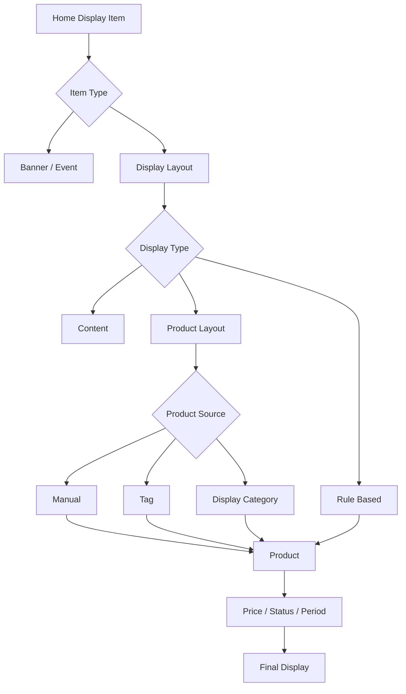
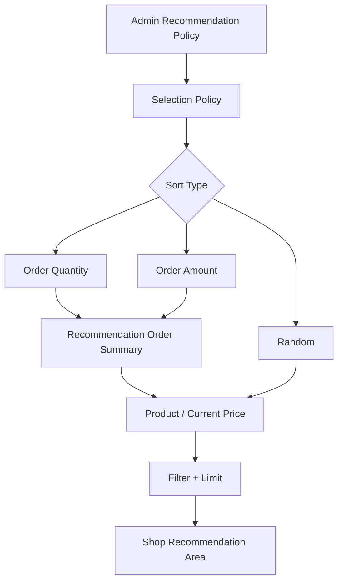
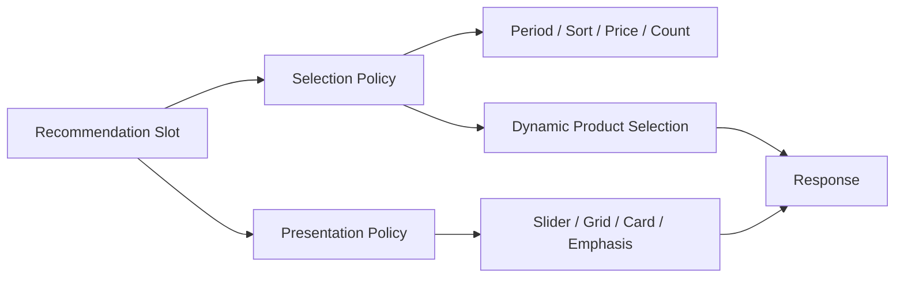

# 한정원

**Backend Engineer · Commerce Display / Recommendation**  
**지원 포지션: 카카오스타일 백엔드 개발자 (전시 시스템)**

Email. devwonny@gmail.com · GitHub. [github.com/dev-wonny](https://github.com/dev-wonny)

Java/Spring 기반으로 백엔드 서비스를 개발해 왔으며, 현재는 커머스 플랫폼의 **전시(Display) 영역을 담당**하고 있습니다.

홈 레이아웃, 배너, 전시 상품, 추천 상품처럼 **사용자에게 어떤 상품과 콘텐츠가 어떤 조건으로 노출되는지**를 코드·DB·API·실제 화면까지 연결해 분석하고 검증합니다. 단순히 설정값이 저장되는지 확인하는 데 그치지 않고, 운영자가 설정한 정책이 실제 상품 조회 조건과 최종 노출 결과까지 이어지는지를 확인합니다.

추천 상품 영역에서는 추천 기준·집계 기간·가격 조건·노출 개수와 Batch 집계 데이터의 연결을 추적했고, 추천 상품 추출 정책과 화면 표현 정책이 분리되지 않은 구조를 분석해 **Selection Policy와 Presentation Policy를 분리하는 확장 방향**을 제안했습니다.

이전에는 DAU 약 **123만** 규모의 글로벌 게임 서비스에서 Backend API와 운영 플랫폼을 개발했으며, AWS 환경의 서비스 생성·배포·운영까지 함께 담당했습니다.

---

## 카카오스타일 전시 시스템과 연결되는 경험

### Commerce Display

- 커머스 플랫폼의 **전시관리 영역 담당**
- 홈 레이아웃의 콘텐츠·배너·상품형 전시를 유형별로 분해하고 실제 데이터 조회 흐름 분석
- 전시 유형별 상품 소스가 수동 매핑, 태그, 전시 카테고리, 리뷰·가격 조건 등에 따라 달라지는 구조 검증
- 상품의 노출 상태, 게시 기간, 현재 가격, 할인 조건 등이 최종 전시에 반영되는 과정 확인
- Admin 설정 → Backend → DB → Shop API → 실제 화면까지 전체 흐름 기준으로 검증

### Recommendation Serving / Policy

- 메뉴·검색·상세·장바구니 등 영역별 추천 상품 정책 분석
- 랜덤 / 누적 주문수량 / 누적 주문금액 기반 추천 조회 로직 검증
- 최근 24시간·3일·7일·14일·30일 집계와 추천 결과의 연결 확인
- 상품 판매가 조건, 노출 상품 수, 노출 여부가 실제 Query에 적용되는지 검증
- 화면의 정책 옵션과 Backend 구현 간 불일치 및 저장되지만 실행되지 않는 설정 발견
- 전체 후보를 랜덤 정렬하는 방식의 상품 증가 시 성능 리스크 식별

### Display Architecture / Extensibility

- 추천 상품이 특정 프론트 UI에 고정된 구조를 분석
- 추천 상품 추출 정책과 전시 디자인 정책의 책임이 다름을 구분
- 기존 전시 모듈을 그대로 결합할 경우 수동 상품 소스와 정책 기반 자동 상품 소스가 충돌할 수 있음을 분석
- 추천 **Selection Policy**와 화면 **Presentation Policy**를 분리해 운영자가 Slider / Grid / Card 등 표현 방식을 확장할 수 있는 방향 제안

### Data Consistency / Operations

- 주문·회원·상품 통계 Batch의 원천 데이터 → 집계 데이터 → 서비스 사용 흐름 검증
- 동일 기준일 재실행·Backfill 시 중복/누락과 멱등성 검증
- AWS ECS(EC2/Fargate), EC2, ALB, S3, CloudFront, CloudWatch 환경의 서비스 배포·운영 경험
- CodePipeline · CodeBuild · CodeDeploy · Jenkins 기반 배포 경험

---

## Core Skills

- **Backend**: Java, Spring, Spring Boot, Spring Batch, MyBatis, JPA, QueryDSL
- **Commerce Domain**: Display, Product, Recommendation Policy, Event, Migration
- **Data**: PostgreSQL, MySQL, MSSQL, Oracle, Redis, DynamoDB
- **Cloud / Runtime**: AWS EC2, ECS(EC2/Fargate), ALB/ELB, S3, CloudFront, Route53, CloudWatch
- **Delivery / Operations**: CodePipeline, CodeBuild, CodeDeploy, Jenkins, Docker, Airflow, ELK
- **Messaging**: Kafka
- **Personal Project / Observability**: GitHub Actions, Prometheus, Grafana, Loki

---

# Experience

## DS GLOBAL

**개발팀 과장 · Backend Engineer**  
**2026.01 — Present**

레거시 쇼핑몰을 신규 커머스 플랫폼으로 전환하는 과정에서 **전시 영역을 담당**하고 있으며, 상품·추천·이벤트 Backend와 Batch 데이터 검증, AWS 실행 환경, 데이터·이미지 마이그레이션을 함께 다루고 있습니다.

## 1. Commerce Display System

**Java · Spring Boot · JPA · QueryDSL · PostgreSQL**

홈 화면에 노출되는 레이아웃과 배너, 이벤트, 상품 영역이 실제로 어떤 데이터와 정책을 기준으로 구성되는지 분석하고 운영·QA 과정의 기준을 정리했습니다.

### 전시 데이터 흐름 분석

홈 전시는 하나의 고정 UI가 아니라 콘텐츠 성격과 상품 선택 방식에 따라 여러 유형으로 분기됩니다. 전시관리 화면만 확인하지 않고 Backend 코드, DB 관계, API Response와 Shop 화면을 함께 따라가며 실제 조회 흐름을 정리했습니다.

### My Role

- 홈 전시의 실제 사용 유형을 **콘텐츠형 / 룰 기반 / 상품 직접매핑 / 상품 소스 분기형**으로 분류
- Editor, Review, Grade, Price Sale, Time Sale, Custom, Emphasis 등 전시 유형별 데이터 흐름 분석
- 수동 상품 지정, Tag, Display Category 등 상품 소스별 조회 조건 확인
- 상품 상태·게시 기간·유효 가격·할인 여부 등 최종 노출 조건 검증
- Admin 목록의 설정값과 실제 Shop 노출 결과가 다른 경우 Backend의 Query 조건까지 추적
- 구현되어 있지 않거나 일부만 동작하는 전시 유형을 식별하고 운영 시 주의사항 정리

단순히 DB 테이블 관계를 문서화하는 것이 아니라 **“운영자가 설정한 전시 정책이 실제 고객 화면에서 어떤 조건을 거쳐 상품으로 바뀌는가”**를 기준으로 구조를 파악했습니다.

---

## 2. Display Preview Policy 검증

전시 운영자가 공개 전의 콘텐츠를 확인하기 위한 Preview 기능에서, 노출 OFF·노출 기간 전후 콘텐츠가 어떤 조건까지 우회되고 어떤 조건은 그대로 적용되는지 검증했습니다.

### 확인한 문제

- 전시 영역의 활성 상태는 Preview에서 완화되지만 상품 자체의 판매·게시·가격 조건은 그대로 적용될 수 있어 **“미리보기”의 의미가 영역마다 다를 수 있음**을 확인
- 일반 Shop 접근과 Admin을 통한 Preview 접근을 구분하는 현재 방식이 강한 인증·인가 수단이 아님을 확인
- 홈 레이아웃과 상단 메뉴 등 Preview 진입점별 정책 적용 범위를 비교

### My Role

- 요구사항의 “관리자만 확인 가능”이라는 표현을 실제 Backend 접근 제어 로직과 비교
- Preview 상태에서 우회되는 전시 조건과 유지되는 상품 조건을 분리해 정리
- 화면 동작만으로 정상 여부를 판단하지 않고 접근 제어와 데이터 API까지 확인
- 향후 Session / Preview Token 등 명시적인 권한 검증 방식이 필요한 지점을 정리

공개 이력서에서는 내부 접근 경로나 재현 가능한 보안 세부정보는 제외했습니다.

---

## 3. Recommendation Product Policy & Serving

**Java · Spring Boot · JPA / QueryDSL · PostgreSQL · Spring Batch**

추천 상품 관리에서는 운영자가 메뉴·검색·상세페이지·장바구니 등 영역별로 추천 기준과 집계 기간, 판매가 조건, 노출 상품 수, 노출 여부를 설정합니다.

더미 및 주문 데이터만으로 모든 케이스를 UI에서 재현하기 어려워, Admin 설정값이 실제 Backend Query와 집계 데이터에 반영되는지를 코드 기준으로 검증했습니다.

### 검증 결과

- 랜덤 추천: 후보 상품을 랜덤 정렬해 설정 개수만큼 조회
- 주문수량순: 상품별 주문 집계의 누적 주문수량 기준 정렬
- 주문금액순: 상품별 주문 집계의 누적 주문금액 기준 정렬
- 집계 기간: 최근 24시간·3일·7일·14일·30일 단위 데이터 사용
- 판매가: 현재 상품 판매가를 기준으로 정책 조건 적용
- 상품 수: Admin 설정값을 Query limit으로 적용
- 노출 여부: 활성 정책만 서비스에서 사용

### 발견한 Gap

- 화면/QA 문서와 Backend가 제공하는 집계 기간 옵션이 서로 다른 부분 발견
- 상세페이지의 적용 범위 설정이 저장되지만 실제 상품 추천 Query에 반영되지 않는 부분 식별
- 랜덤 추천은 주문 집계 기반 추천과 적용 가능한 조건 자체가 다르다는 점을 확인하고 기획 의도 확인 요청
- 랜덤 추천의 전체 후보 정렬 방식이 상품 수 증가 시 응답 성능에 불리할 수 있음을 식별

또한 추천 결과가 주문 원천 데이터를 실시간 조회하는 것이 아니라 사전 집계 데이터를 사용한다는 점을 확인해, 테스트 주문 생성 후 **Batch 수행 시점과 추천 결과 반영 시점이 다르다**는 QA 기준을 정리했습니다.

---

## 4. Recommendation Selection / Presentation 책임 분리 제안

현재 추천 상품은 상품 선정 정책은 Admin에서 관리하지만 화면 표현 방식은 프론트 구현에 의해 고정되어 있습니다.

운영 확장 관점에서 추천 상품도 1열 Slider뿐 아니라 Grid, Card, Image Emphasis, Title/Description 포함형 등 기존 전시 디자인 모듈을 활용할 수 있는지 구조를 검토했습니다.

### 분석한 구조적 문제

기존 전시 모듈은 전시 레이아웃 안에서 상품을 직접 지정하거나 Tag / Display Category를 상품 소스로 사용할 수 있습니다. 반면 추천 상품은 추천 정책을 실행해 상품을 **동적으로 추출**합니다.

따라서 기존 전시 구조를 그대로 추천 상품에 연결하면 **전시가 소유한 상품 소스와 추천 정책이 소유한 상품 소스가 중복**될 수 있습니다.

### 제안 방향

- **Selection Policy**: 어떤 상품을 선택할 것인가
  - 추천 기준
  - 집계 기간
  - 가격 조건
  - 상품 수
  - 노출 범위
- **Presentation Policy**: 선택된 상품을 어떻게 표현할 것인가
  - Slider / Grid / Card
  - Title / Description
  - 이미지 강조 등 Layout Metadata

기존 전시 모듈의 모든 책임을 재사용하기보다 **Presentation capability를 분리해 재사용**하는 방향이 변경 범위와 책임 경계를 더 명확하게 만든다고 판단했습니다.

이 내용은 현재 구조 분석과 개선 제안이며, 구현 완료 사항과 구분해 관리하고 있습니다.

---

## 5. Display / Recommendation Upstream Data 검증

**Spring Batch · Airflow · PostgreSQL · MyBatis · AWS ECS Fargate · Docker · LocalStack**

전시와 추천이 사용하는 상품 주문·찜·인기·회원 요약 데이터의 Batch 구현을 실제 원천 데이터와 정책 기준으로 검증하고 있습니다.

### My Role

- 운영 검증 대상 Batch Job **41개** 기준 검증 범위 정의
- 기존 코드·원천 데이터·신규 구현 간 처리 조건 비교
- 테스트 데이터를 구성하고 기대 결과를 먼저 정의한 뒤 실제 결과와 비교
- 동일 기준일 재실행·Backfill 시 중복/누락과 멱등성 검증
- 잘못된 집계 조건을 Java/MyBatis 코드에서 수정하고 로컬 E2E로 검증
- Docker · PostgreSQL · LocalStack 기반 반복 검증 환경 구성

추천/랭킹 결과는 Serving API만 정확하다고 보장되지 않습니다. **그 API가 신뢰하는 Summary 데이터가 어떤 원천과 기준으로 만들어지는지까지 확인해야 최종 노출 결과를 검증할 수 있다**는 관점으로 작업합니다.

**상세:** [Batch Platform 재설계 및 정책 검증](/resume/cases/batch-validation/)

---

## 6. 쇼핑몰 이벤트 플랫폼 개발 및 운영

**2026.03 — 2026.04**  
**Spring Boot · PostgreSQL · AWS ECS(EC2) · ALB · CodePipeline · CodeBuild · CodeDeploy · ELK**

출석·랜덤 리워드·응모권 이벤트를 내부에서 운영할 수 있도록 Backend를 개발했습니다.

- 이벤트 참여·보상·응모권 API 개발
- 이벤트 유형별 상태와 보상 정책 분석
- 유형별 도메인 차이를 고려한 구조를 제안하고 최종 데이터 모델 제약에 맞춰 구현
- ECS(EC2) 환경 배포 및 운영
- ELK 기반 로그 및 운영 오류 확인
- MAU 약 **16만**, DAU 약 **9,700** 환경에서 운영
- 7일 이벤트 총 응모 **10,950건**, 참여 회원 **6,305명**

**상세:** [Event Platform](/resume/cases/event-platform/)

---

## 7. Commerce Product / Image Migration

**MSSQL · PostgreSQL · AWS S3 · CloudFront**

레거시 쇼핑몰을 신규 플랫폼으로 전환하면서 판매 상품과 공급·발주 상품의 역할 차이를 분석하고 신규 Product 모델과 연결했습니다.

- 판매 상품과 공급 상품의 1:1 / 1:N / N:1 관계 분석
- 사업자번호·업체명·상품코드 기반 매핑 규칙 및 예외 정리
- 판매·전시와 공급·발주의 책임 차이 분석
- 상품·상세·프로모션·게시판 이미지 원천 데이터와 실제 화면 비교
- 원본 이미지 **15,736건**, 생성·변환 이미지 **73,401건**, HTML 이미지 URL **5,053건** 검증
- 마이그레이션 추적 경로와 신규 운영 이미지 경로의 목적 분리

**상세:** [Commerce Product Domain Migration](/resume/cases/commerce/) · [Legacy Image Migration](/resume/cases/image-migration/)

---

# Previous Experience

## DoubleDown Interactive

**서비스개발팀 매니저**  
**2022.10 — 2024.04**

DAU 약 **123만** 규모의 글로벌 소셜카지노 서비스를 운영하는 서비스개발팀에서 Java/Spring Backend API와 운영 플랫폼을 개발했습니다.

### Backend / Product Experiment

- 게임별 상태와 정책을 클라이언트에서 사용할 수 있도록 Backend API 개발
- 사용자 경험에 영향을 주는 레벨·등급 정책 변경을 일부 사용자 대상 A/B 테스트 후 확대 적용
- 실제 서비스 요청과 애플리케이션 로그를 기반으로 운영 이슈 분석

### 광고 시스템 구조 개선

광고 유형 증가로 조건 분기가 복잡해지는 문제를 줄이기 위해 처리 책임을 분리하고 광고 유형별 차이를 Strategy Pattern으로 분리했습니다.

광고팀에서 사용하는 측정 지표를 기준으로 결과를 분석하고 정책을 개선했으며, 변경 후 광고팀 측정 기준 **CTR 약 25% 향상**을 확인했습니다.

### Deeplink / Short URL Platform

- 외부 Deeplink / Short URL 기능을 내부 플랫폼으로 전환
- 링크 정보를 DynamoDB로 관리
- 반복 조회에 Local Cache 적용 후 DynamoDB 접근량 약 **30% 감소**
- 운영자가 Admin에서 링크를 직접 생성·관리할 수 있도록 Self-service 기능 개발

### 반복 업무 자동화

광고 이메일 발송의 대상 추출, Deeplink 생성, 대량 발송 과정을 Spring Batch와 Admin으로 자동화해 사람이 사이트별로 수행하던 **수작업 시간을 약 90% 감소**시켰습니다.

### AWS / Operations

서비스개발팀에서 기능 구현뿐 아니라 EC2/ECS 환경 생성, 배포, 애플리케이션 상태 및 로그 확인까지 함께 담당했습니다.

---

## Future Platform

**서비스개발팀 팀장**  
**2025.06 — 2025.12**

식품의약품안전처 폐쇄망 프로젝트에서 Java/Spring 기반 Backend 개발과 개발 환경 개선을 담당했습니다.

- Java 8 · Spring 4.x · MyBatis 기반 Backend 개발
- 폐쇄망 환경의 실행·배포 절차와 의존 라이브러리 관리
- 반복되는 개발 환경 설정 문제를 줄이기 위한 실행·배포 문서 정리
- 팀 단위 개발 일정과 Backend 업무 조율

---

## AdMax / FSN

**R&D팀 매니저**  
**2020.01 — 2022.08**

한국·대만에서 운영되는 디지털 광고 서비스의 Tracking 및 FDS 시스템을 담당했습니다.

- Click Server · Action Server · Batch Job 등 광고 Tracking Backend 유지보수 및 신규 기능 개발
- 광고 요청·전환 데이터를 처리하는 Java/Spring 서비스 운영
- 운영 로그와 Request Pattern을 기반으로 장애 및 트래픽 이슈 분석
- 반복 운영 업무를 줄이기 위한 Backend / Batch 기능 개선

---

# How I Work

### 설정이 존재하는 것과 기능이 동작하는 것은 다르다고 생각합니다

Admin에 옵션이 있고 DB에 값이 저장되더라도 실제 서비스 Query에서 사용되지 않으면 사용자에게는 동작하지 않는 기능입니다. 설정 → 저장 → 조회 → 최종 노출까지 전체 흐름을 확인합니다.

### 실행되는 코드와 올바른 결과를 만드는 코드를 구분합니다

Batch나 추천 Query가 오류 없이 실행되는 것만으로 완료라고 판단하지 않습니다. 실제 서비스 정책과 원천 데이터를 기준으로 기대 결과를 먼저 정의하고 비교합니다.

### 재사용보다 책임 경계를 먼저 봅니다

기존 Display Layout을 Recommendation에 재사용할 수 있다는 이유만으로 전체 구조를 결합하기보다, 상품을 선택하는 책임과 화면에 표현하는 책임이 어디에 있어야 하는지 먼저 구분합니다.

### 기술적 대안과 운영 제약을 함께 설명합니다

정책이 불명확하거나 여러 구현 방법이 가능한 경우 코드만 작성하기보다 현재 구조, 변경 범위, 운영 영향과 Trade-off를 정리해 이해관계자와 합의 가능한 형태로 제안합니다.
