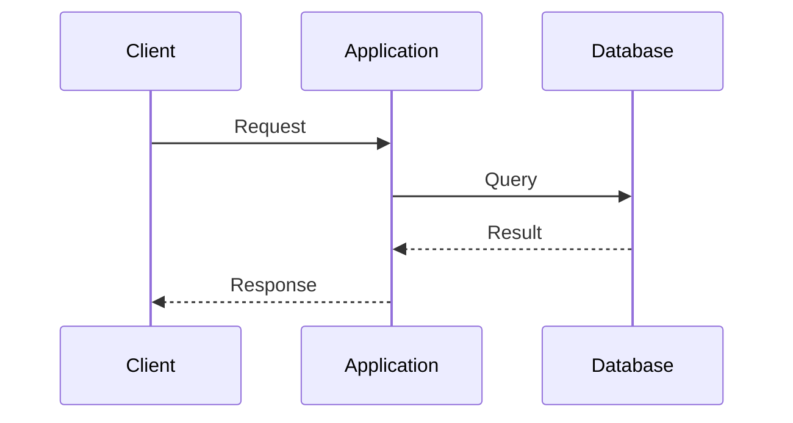

# 아키텍처 제목

## 핵심 요약

- 목적:
- 핵심 결정:
- 적용 범위:
- 가장 큰 trade-off:

## 목적

이 구조가 해결하는 문제를 적습니다.

## 범위

### 포함

- 포함 범위

### 제외

- 제외 범위

## 구성 요소

| 구성 요소 | 책임 | 상태 보유 여부 |
|---|---|---|
| 구성 요소 A | 책임 | 상태 |

## 요청 흐름

## 데이터 흐름

데이터의 생성, 저장, 전달, 만료 지점을 설명합니다.

## 장애 지점

| 장애 지점 | 영향 | 감지 | 복구 |
|---|---|---|---|
| 지점 A | 영향 | 지표 | 복구 절차 |

## 보안

- 인증과 인가 경계:
- 네트워크 경계:
- 저장 및 전송 보호:
- 감사 기록:

## 운영

- 배포:
- 확장:
- 관측성:
- 백업과 복구:

## 대안과 trade-off

| 대안 | 선택 조건 | 포기하는 것 |
|---|---|---|
| A | 조건 | 비용 |

## 검증 계획

- 기능:
- 성능:
- 장애:
- 보안:

## 참고자료

- 공식 문서 링크
