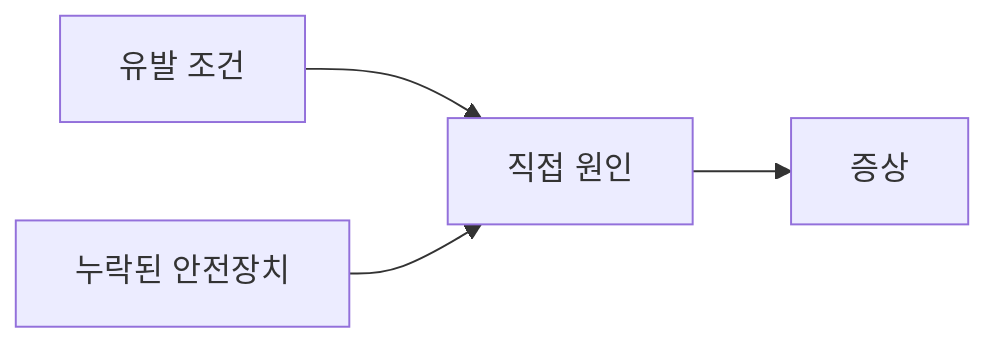

# 문제 제목

## 핵심 요약

- 증상:
- 원인:
- 해결:
- 재발 방지:

## 증상

관찰 가능한 현상을 시간 순서로 작성합니다.

## 영향

| 대상 | 영향 | 확인 방법 |
|---|---|---|
| 사용자 또는 시스템 | 영향 | 지표 또는 재현 절차 |

## 원인

직접 원인과 구조적 원인을 구분합니다.



## 확인 방법

```text
안전한 읽기 전용 확인 명령을 작성합니다.
```

## 해결 방법

### 임시 복구

- 조치와 되돌리는 방법

### 영구 해결

- 코드, 설정, 데이터 모델 변경

## 재발 방지

- 테스트:
- 모니터링:
- 운영 절차:
- 소유자와 검토 시점:

## 참고자료

- 공식 문서 링크
